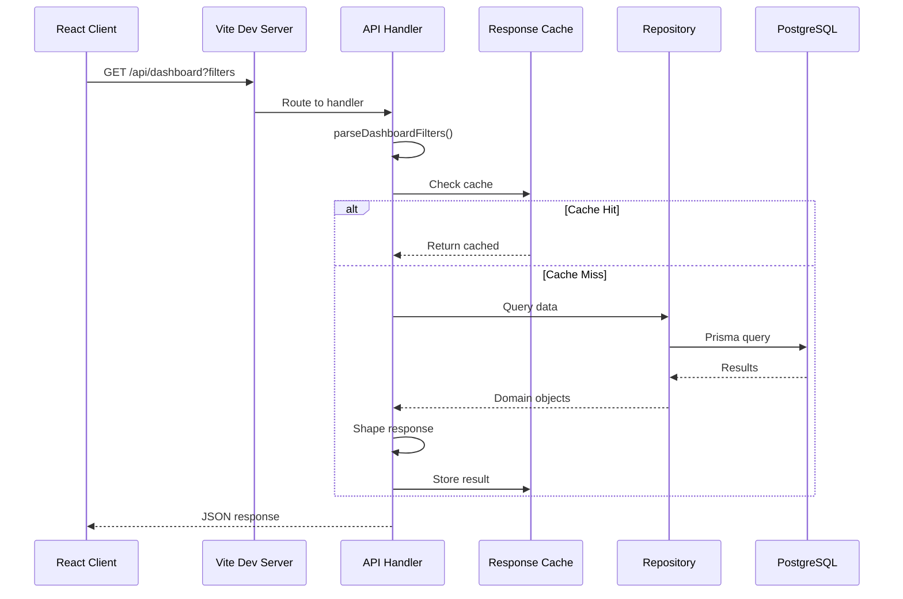
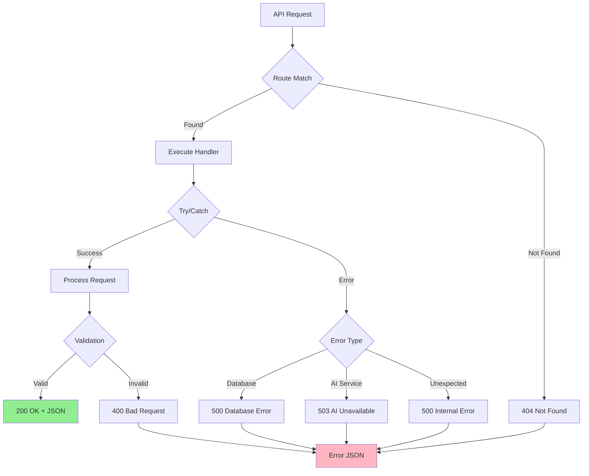

# BharatZero API Reference

Complete API documentation for the BharatZero legislative explorer.

## Base URL

```
Production: http://HOST:PORT/api
Development: http://127.0.0.1:5173/api
```

## Authentication

Public endpoints - no authentication required for read operations.

## Response Format

All responses are JSON with UTF-8 encoding:

```http
Content-Type: application/json; charset=utf-8
```

---

## API Architecture

### Request/Response Flow



### Error Handling Flow



---

## Endpoints

### Health Check

Check API and database connectivity.

```http
GET /api/health
```

**Response (200 OK)**

```json
{
  "ok": true,
  "database": "connected",
  "bills": 4708,
  "aiAnalyses": 42
}
```

**Response (503 Service Unavailable)**

```json
{
  "ok": false,
  "database": "unavailable"
}
```

---

### Dashboard Data

Retrieve sectioned dashboard data with filters and pagination.

```http
GET /api/dashboard?section={section}&lang={lang}&pm={pm}&house={house}&date={date}&status={status}&area={area}&source={source}&page={page}&pageSize={pageSize}
```

**Query Parameters**

| Parameter | Type | Required | Description |
|-----------|------|----------|-------------|
| `section` | string | Yes | Section ID: `overview`, `houses`, `states`, `timeline`, `bills`, `committees`, `questions`, `debates`, `acts`, `sources` |
| `lang` | string | No | Language: `en` (default), `hi` |
| `pm` | string | No | Prime Minister term ID: `all`, `nehru`, `indira-gandhi-1`, `modi-2`, etc. |
| `house` | string | No | House filter: `all`, `lok-sabha`, `rajya-sabha` |
| `date` | string | No | Date filter (YYYY-MM-DD) |
| `status` | string | No | Bill stage: `introduced`, `passed_origin_house`, etc. |
| `area` | string | No | Ministry/policy area |
| `source` | string | No | Source family: `source-sansad`, `source-prs`, `source-pdl`, `source-data-gov` |
| `page` | number | No | Page number (default: 1) |
| `pageSize` | number | No | Items per page (default: 60, max: 100) |

**Section-Specific Responses**

#### Overview Section

Returns summary stats, recent bills, and timeline preview.

```json
{
  "filters": { ... },
  "meta": { ... },
  "seedMeta": { ... },
  "sources": [ ... ],
  "bills": [...],           // First 5 bills
  "allBills": [],           // Empty (full list not sent)
  "billActions": [],        // Empty
  "timelineEvents": [...],  // First 12 events
  "timelineGroups": [...],  // Grouped by date
  "committees": [...],
  "questions": [],
  "debates": [],
  "acts": [],
  "actBills": [],
  "primeMinisters": [...],
  "houses": [...],
  "lokSabhaPower": { ... }
}
```

#### Bills Section

Returns paginated bill list with full metadata.

```json
{
  "filters": { ... },
  "bills": [...],           // Paginated bills
  "allBills": [],           // Empty (payload optimization)
  "billActions": [],        // Empty
  "timelineEvents": [],     // Empty
  "timelineGroups": [],     // Empty
  "timelineDateRail": [],   // Empty
  "committees": [...],
  "questions": [],
  "debates": [],
  "acts": [],
  "actBills": [],
  "sources": [...]
}
```

#### Timeline Section

Returns chronological timeline with date rail.

```json
{
  "filters": { ... },
  "bills": [],              // Empty
  "timelineEvents": [...],  // All timeline events
  "timelineGroups": [...],  // Grouped by date
  "timelineDateRail": [...], // Date navigation
  "committees": [],
  "questions": [],
  "debates": [],
  "acts": [],
  "actBills": [],
  "sources": []
}
```

#### Houses Section

Returns Lok Sabha power data for selected PM term.

```json
{
  "filters": { ... },
  "bills": [],              // Empty (houses view)
  "timelineEvents": [],
  "timelineGroups": [],
  "timelineDateRail": [],
  "committees": [],
  "questions": [],
  "debates": [],
  "acts": [],
  "actBills": [],
  "lokSabhaPower": {        // Power composition data
    "id": "...",
    "lok_sabha": "11",
    "period": "1989-1991",
    "election_year": 1989,
    "largest_party": "INC",
    "largest_party_seats": 197,
    "runner_up_party": "JD",
    "runner_up_seats": 143,
    "governing_side": "National Front",
    "governing_seats": 145,
    "majority_mark": 272,
    "power_summary": "...",
    "composition": { ... }
  }
}
```

#### States Section

The States tab is a static client-side governance view. It uses `src/lib/domain/state-governance.ts` and `src/lib/assets/india-state-boundaries.ts`, not `/api/dashboard`, for the map/list dataset. The section is still a valid navigation value so shared URL parsing keeps `/?section=states` stable.

#### Committees Section

Returns parliamentary committee data.

#### Questions Section

Returns parliamentary questions data.

#### Debates Section

Returns debate records and metadata. In Prisma repository mode, debates come from the `Debate` table and can include transcript metadata through the `DebateTranscript` relationship; seed mode reads generated/manual debate arrays.

#### Acts Section

Returns enacted legislation (Acts) data.

#### Sources Section

Returns source catalog and coverage information.

---

### Bill Detail

Retrieve detailed information for a specific bill.

```http
GET /api/bills/{billId}
```

**Path Parameters**

| Parameter | Type | Description |
|-----------|------|-------------|
| `billId` | string | Bill unique identifier |

**Response (200 OK)**

```json
{
  "bill": {
    "id": "bill-123",
    "title_en": "The Finance Bill, 2024",
    "title_hi": "वित्त विधेयक, 2024",
    "bill_number": "Bill No. 12 of 2024",
    "bill_year": 2024,
    "bill_type": "money",
    "origin_house": "lok-sabha",
    "current_stage": "passed_lok_sabha",
    "ministry": "Ministry of Finance",
    "introduced_on": "2024-02-01",
    "latest_action_date": "2024-03-15",
    "source_url": "https://sansad.in/...",
    "summary": "...",
    "isDemoSeed": false
  },
  "actions": [...],
  "timelineEvents": [...],
  "acts": [...],
  "aiAnalysis": { ... },
  "sourceTexts": [...]
}
```

**Response (404 Not Found)**

```json
{
  "error": "Bill not found."
}
```

---

### Bill AI Analysis

Generate or retrieve AI-powered bill analysis.

```http
GET /api/bills/{billId}/ai-analysis?lang={lang}&provider={provider}
```

**Path Parameters**

| Parameter | Type | Description |
|-----------|------|-------------|
| `billId` | string | Bill unique identifier |

**Query Parameters**

| Parameter | Type | Required | Description |
|-----------|------|----------|-------------|
| `lang` | string | No | Language: `en` (default), `hi` |
| `provider` | string | No | AI provider: `groq` (default), `nvidia` |

**Response (200 OK)**

```json
{
  "provider": "groq",
  "model": "llama-3.3-70b-versatile",
  "analysis": {
    "summary": "...",
    "keyPoints": [...],
    "impact": "...",
    "concerns": [...]
  },
  "generatedAt": "2024-05-01T10:30:00Z",
  "sourceText": {
    "charCount": 15420,
    "status": "extracted"
  }
}
```

**Response (502 Bad Gateway)**

```json
{
  "error": "AI bill analysis is unavailable."
}
```

**Caching Behavior**

- Analysis results are cached by bill ID, language, provider, model, and input hash
- Cached analyses are returned immediately without re-processing
- Cache persists in PostgreSQL (`AiBillAnalysis` table)

---

### Prime Ministers

List all Prime Minister terms with profiles and power data.

```http
GET /api/prime-ministers
```

**Response (200 OK)**

```json
{
  "items": [
    {
      "id": "nehru",
      "name": "Jawaharlal Nehru",
      "termStart": "1947-08-15",
      "termEnd": "1964-05-27",
      "party": "INC",
      "lokSabha": "1-3",
      "profile": {
        "summary": "...",
        "highlights": [...],
        "sourceUrl": "..."
      },
      "power": {
        "lok_sabha": "2",
        "largest_party": "INC",
        "largest_party_seats": 364,
        "governing_seats": 364
      }
    }
  ]
}
```

---

### Prime Minister Detail

Retrieve specific PM term with profile and power data.

```http
GET /api/prime-ministers/{termId}
```

**Path Parameters**

| Parameter | Type | Description |
|-----------|------|-------------|
| `termId` | string | PM term ID: `nehru`, `modi-2`, etc. |

**Response (200 OK)**

```json
{
  "term": {
    "id": "nehru",
    "name": "Jawaharlal Nehru",
    "termStart": "1947-08-15",
    "termEnd": "1964-05-27",
    "party": "INC",
    "lokSabha": "1-3"
  },
  "profile": {
    "summary": "...",
    "highlights": [...],
    "sourceLabel": "PM India",
    "sourceUrl": "..."
  },
  "power": {
    "lok_sabha": "2",
    "period": "1957-1962",
    "largest_party": "INC",
    "largest_party_seats": 364,
    "governing_side": "Indian National Congress",
    "governing_seats": 364,
    "majority_mark": 272,
    "composition": { ... }
  }
}
```

**Response (404 Not Found)**

```json
{
  "error": "Prime Minister term not found."
}
```

---

### House Power

Retrieve Lok Sabha power composition for a PM term.

```http
GET /api/houses/power?pm={termId}
```

**Query Parameters**

| Parameter | Type | Required | Description |
|-----------|------|----------|-------------|
| `pm` | string | Yes | PM term ID |

**Response (200 OK)**

```json
{
  "power": {
    "id": "...",
    "lok_sabha": "17",
    "period": "2019-2024",
    "election_year": 2019,
    "largest_party": "BJP",
    "largest_party_seats": 303,
    "runner_up_party": "INC",
    "runner_up_seats": 52,
    "governing_side": "NDA",
    "governing_seats": 353,
    "majority_mark": 272,
    "power_summary": "...",
    "composition": {
      "BJP": 303,
      "INC": 52,
      "...": ...
    }
  }
}
```

**Response (404 Not Found)**

```json
{
  "error": "House power snapshot not found."
}
```

---

### Sources Catalog

Retrieve metadata about data sources and coverage.

```http
GET /api/sources
```

**Response (200 OK)**

```json
{
  "primeMinisterProfiles": 15,
  "primeMinisterProfileSources": [
    { "url": "https://...", "kind": "pm-profile" }
  ],
  "housePowerSnapshots": 16,
  "housePowerSources": [
    { "url": "https://...", "kind": "house-power" }
  ]
}
```

---

## Error Responses

All errors follow a consistent format:

```json
{
  "error": "Human-readable error message"
}
```

**Status Codes**

| Code | Meaning | Common Causes |
|------|---------|---------------|
| 400 | Bad Request | Missing URL, invalid parameters |
| 404 | Not Found | Bill/PM/House not found |
| 405 | Method Not Allowed | Non-GET request |
| 500 | Internal Server Error | Unexpected error |
| 502 | Bad Gateway | AI service unavailable |
| 503 | Service Unavailable | Database connection failed |

---

## Caching

The API implements multiple caching strategies:

### Dashboard Cache

- **TTL**: 20 seconds
- **Scope**: In-memory per server instance
- **Key**: Full filter set (section, lang, pm, house, etc.)
- **Deduplication**: Concurrent requests with same key share a single promise

### Bill Detail Cache

- **TTL**: 60 seconds
- **Scope**: In-memory per server instance
- **Key**: Bill ID

### AI Analysis Cache

- **TTL**: Indefinite (persistent storage)
- **Scope**: PostgreSQL (`AiBillAnalysis` table)
- **Key**: Bill ID + language + provider + model + input hash

---

## Rate Limiting

No explicit rate limits are enforced. However:

- Dashboard cache reduces database load for repeated queries
- AI analysis has implicit limits based on provider quotas
- Database connection pooling is configured for optimal throughput

---

## Data Types

### Bill

```typescript
{
  id: string;
  title_en: string;
  title_hi: string;
  bill_number: string;
  bill_year: number;
  bill_type: 'ordinary' | 'money' | 'financial' | 'constitutional-amendment';
  origin_house: 'lok-sabha' | 'rajya-sabha' | ...;
  current_stage: string; // Bill stage identifier
  ministry: string;
  introduced_on: string; // ISO date
  latest_action_date: string; // ISO date
  source_url: string;
  summary: string;
  isDemoSeed: boolean;
}
```

### Bill Action

```typescript
{
  id: string;
  bill_id: string;
  date: string;
  house: House;
  action_type: TimelineEventType | 'money_bill_window' | 'president_assent';
  description: string;
  source_url: string;
  isDemoSeed: boolean;
}
```

### Timeline Event

```typescript
{
  id: string;
  date: string;
  house: House;
  type: TimelineEventType;
  title: string;
  description: string;
  related_bill_id?: string;
  source_url: string;
  isDemoSeed: boolean;
}
```

---

## Examples

### cURL Examples

```bash
# Health check
curl http://127.0.0.1:5173/api/health

# Dashboard overview
curl "http://127.0.0.1:5173/api/dashboard?section=overview&lang=en"

# Bills with filters
curl "http://127.0.0.1:5173/api/dashboard?section=bills&lang=en&pm=nehru&page=1&pageSize=20"

# PM House power
curl "http://127.0.0.1:5173/api/houses/power?pm=vajpayee-2"

# Bill detail
curl http://127.0.0.1:5173/api/bills/bill-123

# AI analysis
curl "http://127.0.0.1:5173/api/bills/bill-123/ai-analysis?lang=en"
```

### JavaScript/TypeScript Examples

```typescript
// Fetch dashboard
const dashboard = await fetch('/api/dashboard?section=bills&page=1')
  .then(r => r.json());

// Fetch bill with AI analysis
const [bill, analysis] = await Promise.all([
  fetch(`/api/bills/${billId}`).then(r => r.json()),
  fetch(`/api/bills/${billId}/ai-analysis`).then(r => r.json())
]);

// Fetch PM data
const pmData = await fetch('/api/prime-ministers/nehru').then(r => r.json());
```

---

## Related Documentation

- [Architecture Overview](./ARCHITECTURE.md)
- [Database Schema](./DATABASE.md)
- [Data Pipeline](./DATA_PIPELINE.md)
- [API Flow Diagrams](./diagrams/api-flows.md) - Detailed sequence and flow diagrams
- [Frontend Architecture](./diagrams/frontend-architecture.md) - Component hierarchy and data flow
- [Bill Lifecycle](./diagrams/bill-lifecycle.md) - State machine diagrams for bill stages
