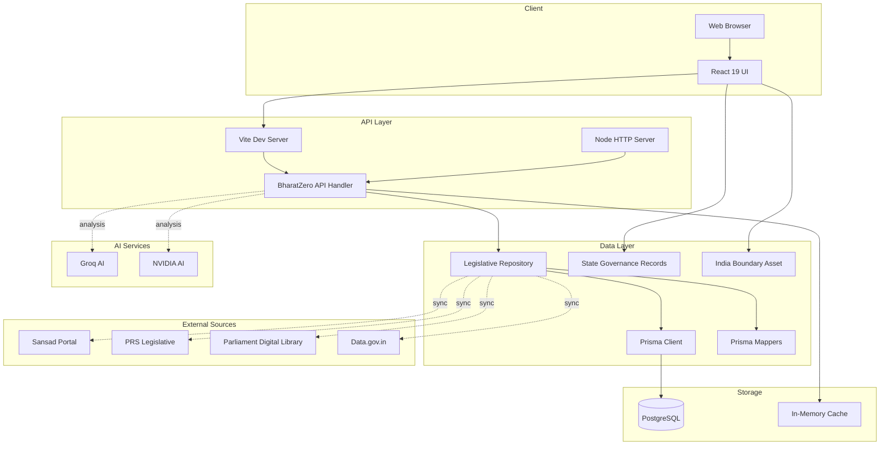
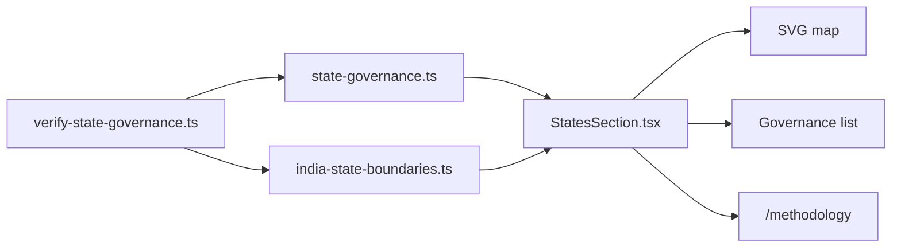
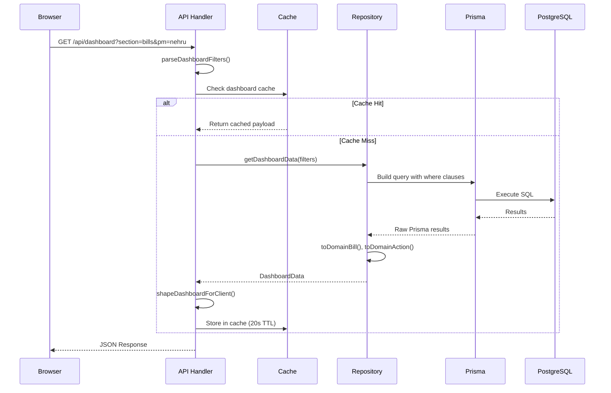
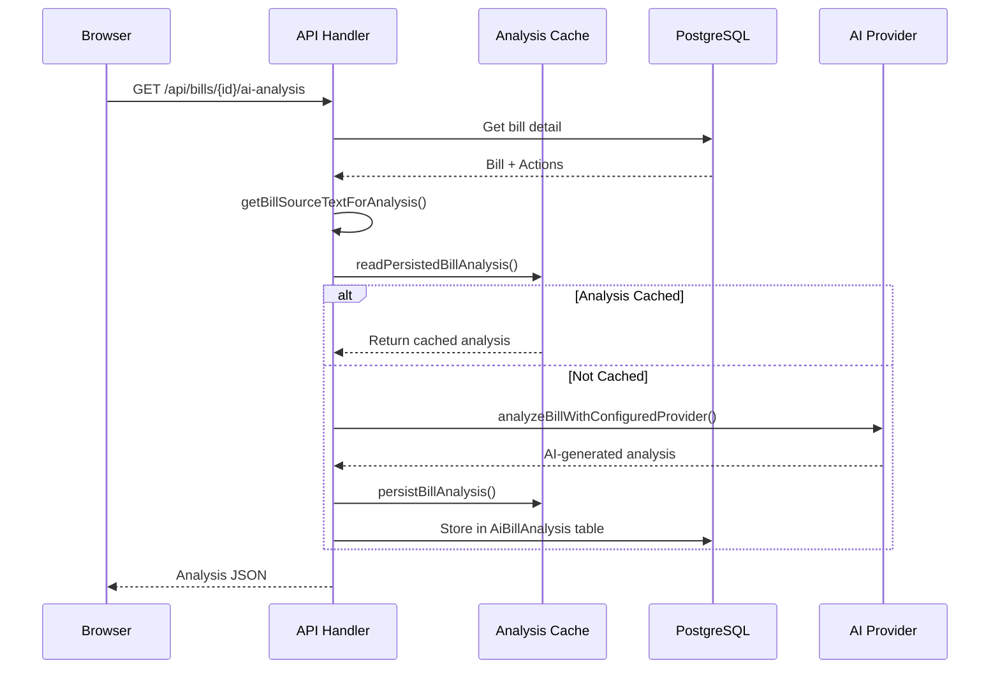
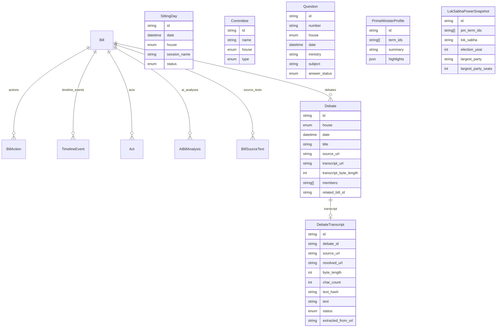
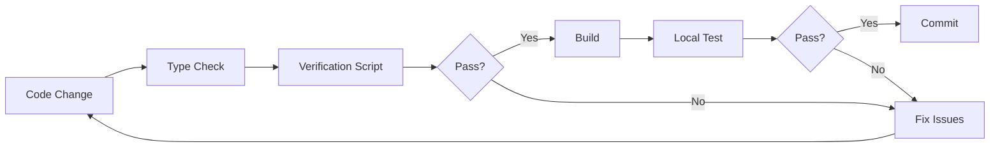

# BharatZero Architecture

System architecture, component relationships, and data flow documentation.

## System Overview

BharatZero is a full-stack legislative explorer application with:

- **Frontend**: React 19 + Vite + Tailwind CSS
- **Backend**: Node.js HTTP server with API routes
- **Database**: PostgreSQL (Prisma ORM)
- **Data Pipeline**: TypeScript sync/upsert scripts
- **Static Governance View**: Source-backed state/UT governance records and a self-hosted India boundary asset

## Architecture Diagram



## Component Architecture

### Frontend Layer

```
src/
├── App.tsx                    # Main React application
├── main.tsx                   # React entry point
├── routes/                    # SvelteKit route shell (legacy/server)
│   ├── +page.server.ts       # Server-side data loading
│   └── bills/[billId]/        # Bill detail routes
└── lib/
    ├── domain/               # Domain models and business logic
    │   ├── types.ts          # Core type definitions
    │   ├── dashboard-filters.ts
    │   ├── prime-ministers.ts
    │   ├── parliament-houses.ts
    │   ├── state-governance.ts
    │   ├── economic-impact.ts
    │   ├── navigation-links.ts
    │   ├── timeline-view.ts
    │   └── localization.ts
    ├── components/           # Reusable and feature UI
    │   ├── bills/
    │   ├── filters/
    │   ├── shell/
    │   ├── states/           # States tab and methodology
    │   └── timeline/
    ├── assets/
    │   └── india-state-boundaries.ts
    └── data/                 # Data layer
        ├── view-model.ts     # View model types
        ├── seed.ts           # Seed data loader
        └── generated/        # Generated datasets
```

#### Domain Layer

| Module | Responsibility |
|--------|---------------|
| `types.ts` | Core domain types (Bill, BillAction, TimelineEvent, etc.) |
| `dashboard-filters.ts` | URL filter parsing and validation |
| `prime-ministers.ts` | PM term definitions and date ranges |
| `prime-minister-profiles.ts` | PM profile data and highlights |
| `parliament-houses.ts` | Lok Sabha/Rajya Sabha power data |
| `timeline-view.ts` | Timeline grouping and date rail |
| `bill-stage-machine.ts` | Bill stage state transitions |
| `localization.ts` | English/Hindi label translations |
| `economic-impact.ts` | Local GDP/impact fallback analysis for bills |
| `navigation-links.ts` | Section navigation labels and grouping |
| `state-governance.ts` | Static state/UT governance model, palette, labels, and invariants |

### Backend Layer

```
src/lib/server/
├── api/
│   └── bharatzero-api.ts     # API route handlers
├── repositories/
│   ├── legislative.ts        # Repository pattern implementation
│   └── prisma-mappers.ts     # Domain/Prisma type conversion
├── ai/
│   ├── groq-bill-analysis.ts # AI analysis provider
│   ├── persistent-analysis-cache.ts
│   └── source-text.ts        # Source text extraction
└── db/
    └── prisma.ts             # Prisma client factory
```

#### Repository Pattern

The `LegislativeRepository` abstracts data access:

```typescript
// Repository modes
export type RepositoryMode = 'seed' | 'prisma';

// Repository interface
interface LegislativeRepository {
  getDashboardData(filters: DashboardFilters): Promise<DashboardData>;
  getBillDetail(billId: string): Promise<BillDetailData | null>;
}
```

| Mode | Use Case | Data Source |
|------|----------|-------------|
| `seed` | Static dataset | Generated TypeScript files |
| `prisma` | Runtime queries | PostgreSQL via Prisma |

#### API Handler Flow

```
HTTP Request
    ↓
URL Parsing & Routing
    ↓
Filter Parsing (parseDashboardFilters)
    ↓
Repository Query (getDashboardData / getBillDetail)
    ↓
Response Shaping (shapeDashboardForClient)
    ↓
JSON Response
```

**Caching Strategy:**

```
Request → Cache Check → Cache Hit? → Yes → Return Cached
                                 ↓
                                 No
                                 ↓
                    Deduplication Check → Pending? → Wait for Promise
                                               ↓
                                               No
                                               ↓
                                    Execute Query → Store Cache → Return
```

### Data Pipeline

```
External Sources
      ↓
Source Discovery (scripts/discover-source-catalogs.ts)
      ↓
Sync Scripts (scripts/sync-*.ts)
      ↓
Generated Data Files (src/lib/data/generated/*.ts)
      ↓
Upsert Scripts (scripts/upsert-*.ts)
      ↓
PostgreSQL Database
      ↓
Prisma Repository
      ↓
API Response

Static state governance follows a separate path: `state-governance.ts` and `india-state-boundaries.ts` are imported directly by the States tab and verified by `verify:state-governance`.
```

#### Source Adapters

| Adapter | Status | Source | Outputs |
|---------|--------|--------|---------|
| `sansad` | Using Now | https://sansad.in/ | Bills, Actions, Timeline, Committees |
| `prs` | Using Now | https://prsindia.org/ | Historical bills (1992-2019) |
| `pdl` | Using Now | https://eparlib.sansad.in/ | Pre-2004 proceedings |
| `data-gov` | Using Now | https://data.gov.in/ | Questions, Debates |
| `state-governance` | Static V1 | source links per row + Bharat Maps boundary asset | State/UT governance map |
| `lok-sabha` | Future | https://sansad.in/ls | Planned direct integration |
| `rajya-sabha` | Future | https://sansad.in/rs | Planned direct integration |
| `india-code` | Future | https://www.indiacode.nic.in/ | Acts and enacted laws |
| `egazette` | Future | https://egazette.nic.in/ | Gazette notifications |
| `neva` | Future | https://neva.gov.in/ | State legislatures |

#### Ingestion Pipeline Steps

```
1. SOURCE_CAPTURE     → Fetch from external source
2. NORMALIZATION      → Transform to domain model
3. STAGE_RESOLUTION   → Resolve bill stages
4. READ_MODEL_PUBLISH → Write to database
```

### State Governance Static Flow



## Data Flow

### Dashboard Request Flow



### AI Analysis Flow



## Database Schema

### Entity Relationship Diagram



### Key Tables

| Table | Purpose | Key Columns |
|-------|---------|-------------|
| `Bill` | Legislative bills | `id`, `title_en`, `title_hi`, `bill_number`, `current_stage`, `ministry` |
| `BillAction` | Bill lifecycle events | `bill_id`, `date`, `house`, `action_type` |
| `TimelineEvent` | Parliamentary timeline | `date`, `house`, `type`, `related_bill_id` |
| `Debate` | Parliamentary debate metadata | `title`, `date`, `house`, `transcript_url`, `members`, `related_bill_id` |
| `DebateTranscript` | Debate transcript metadata and extracted text | `debate_id`, `source_url`, `resolved_url`, `text`, `char_count`, `status` |
| `Question` | Parliamentary questions | `number`, `date`, `ministry`, `answer_status` |
| `Act` | Enacted legislation | `title`, `act_number`, `year`, `linked_bill_id` |
| `AiBillAnalysis` | AI-generated analysis | `bill_id`, `language`, `provider`, `analysis` (JSON) |
| `PrimeMinisterProfile` | PM biographical data | `term_ids`, `summary`, `highlights` |
| `LokSabhaPowerSnapshot` | House composition | `lok_sabha`, `election_year`, `composition` (JSON) |

## Caching Architecture

### Multi-Level Caching

```
┌─────────────────────────────────────────────────────────────┐
│  Level 1: In-Memory Cache (API Handler)                     │
│  • Dashboard: 20s TTL per filter combination                │
│  • Bill Detail: 60s TTL per bill ID                       │
│  • Request deduplication for concurrent identical queries   │
└─────────────────────────────────────────────────────────────┘
                              ↓
┌─────────────────────────────────────────────────────────────┐
│  Level 2: Database Query Cache (Prisma)                   │
│  • Prisma connection pooling                               │
│  • Prepared statement caching                              │
└─────────────────────────────────────────────────────────────┘
                              ↓
┌─────────────────────────────────────────────────────────────┐
│  Level 3: Persistent Analysis Cache (PostgreSQL)        │
│  • AI analysis results by (bill, lang, provider, hash)   │
│  • Indefinite TTL                                          │
└─────────────────────────────────────────────────────────────┘
```

## Deployment Architecture

### Docker Deployment

```
┌────────────────────────────────────────────────────────────┐
│  Docker Host                                               │
│  ┌─────────────────────────┐  ┌─────────────────────────┐ │
│  │  Node Container         │  │  PostgreSQL Container   │ │
│  │  ┌───────────────────┐  │  │  ┌───────────────────┐  │ │
│  │  │  Vite Build       │  │  │  │  PostgreSQL 15    │  │ │
│  │  │  Node API Server  │  │  │  │  BharatZero DB    │  │ │
│  │  │  (Port 5173/5174) │  │  │  │  (Port 5432)      │  │ │
│  │  └───────────────────┘  │  │  └───────────────────┘  │ │
│  └─────────────────────────┘  └─────────────────────────┘ │
└────────────────────────────────────────────────────────────┘
```

### Vercel Deployment

```
┌────────────────────────────────────────────────────────────┐
│  Vercel Edge Network                                       │
│  ┌─────────────────────────┐                               │
│  │  Static Frontend (dist/) │  Served from Edge             │
│  │  - React bundle          │                               │
│  │  - index.html            │                               │
│  └─────────────────────────┘                               │
│           ↓ /api/* → Rewrite                                 │
│  ┌─────────────────────────┐                               │
│  │  External API Server     │  (Docker/Node elsewhere)      │
│  │  - Node API handler      │                               │
│  │  - PostgreSQL            │                               │
│  └─────────────────────────┘                               │
└────────────────────────────────────────────────────────────┘
```

## Security Considerations

### API Security

| Concern | Mitigation |
|---------|------------|
| SQL Injection | Prisma ORM parameterized queries |
| XSS | React automatic escaping |
| CSRF | No state-changing operations (read-only API) |
| Rate Limiting | Dashboard cache deduplication |

### AI Security

| Concern | Mitigation |
|---------|------------|
| API Key Exposure | Server-only environment variables |
| Prompt Injection | Structured prompts, input validation |
| Content Moderation | Provider-level safety filters |

## Scalability Considerations

### Current Limitations

1. **In-memory cache** is per-server-instance (no distributed cache)
2. **Database** single primary (no read replicas)
3. **AI analysis** is synchronous (blocks request)

### Scaling Strategies

| Component | Current | Future Strategy |
|-----------|---------|-----------------|
| Cache | In-memory Map | Redis cluster |
| Database | Single PostgreSQL | Read replicas, connection pooling |
| AI Analysis | Synchronous | Async queue (BullMQ) |
| Static Assets | Vite dev server | CDN (Vercel Edge) |

## Development Workflow



### Verification Pipeline

```
npm run check           → TypeScript type checking
npm run verify:sources  → Source discovery validation
npm run verify:repos    → Repository layer tests
npm run verify:mappers  → Prisma mapper validation
npm run verify:timeline → Timeline view tests
npm run verify:ai       → AI analysis tests
npm run verify:debate-upsert-rules → Debate upsert ownership tests
npm run verify:debate-transcripts → Debate repository/API transcript tests
npm run verify:state-governance → Static state governance map tests
npm run verify:data-pipeline → Full pipeline test
```

## Technology Stack Summary

| Layer | Technology | Version |
|-------|------------|---------|
| Runtime | Node.js | 22.x |
| Frontend | React | 19.x |
| Build Tool | Vite | 8.x |
| Styling | Tailwind CSS | 4.x |
| ORM | Prisma | 7.x |
| Database | PostgreSQL | 15+ |
| AI | Groq/NVIDIA | Latest |
| Language | TypeScript | 6.x |

---

## Related Documentation

- [API Reference](./API_REFERENCE.md)
- [Database Schema](./DATABASE.md)
- [Data Pipeline](./DATA_PIPELINE.md)
- [Developer Guide](./DEVELOPER_GUIDE.md)
- Diagrams
  - [Bill Lifecycle State Machines](./DIAGRAM_BILL_LIFECYCLE.md)
  - [API Flow Diagrams](./DIAGRAM_API_FLOWS.md)
  - [Frontend Component Architecture](./DIAGRAM_FRONTEND_ARCHITECTURE.md)
  - [State Governance Diagrams](./DIAGRAM_STATE_GOVERNANCE.md)
