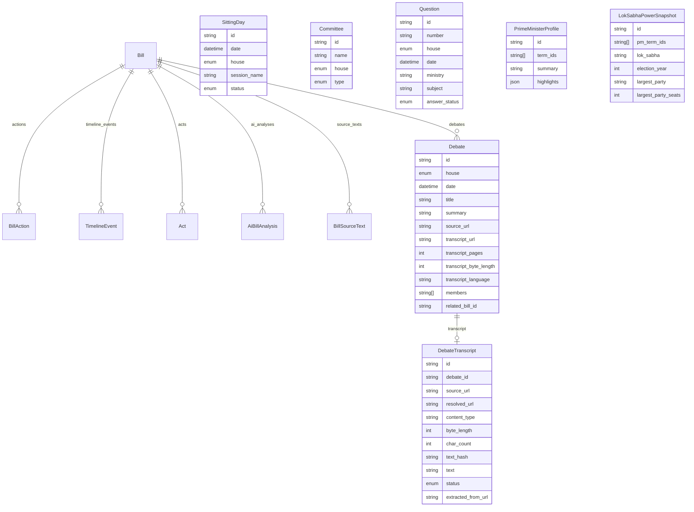
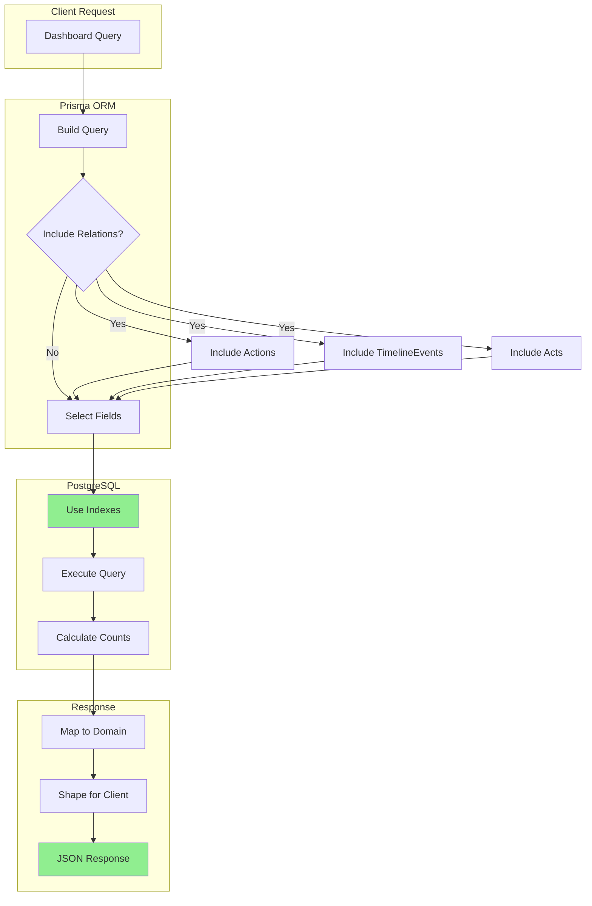

# BharatZero Database Documentation

Complete database schema documentation for the BharatZero legislative explorer.

## Overview

BharatZero uses PostgreSQL as its primary data store with Prisma ORM for type-safe database access. The schema is designed to capture:

- Legislative bills and their lifecycle
- Parliamentary timeline events
- Parliamentary questions and debates
- Committee information
- Enacted legislation (Acts)
- AI-generated bill analysis
- Prime Minister profiles and House power composition

The States tab is intentionally static in v1 and is not stored in PostgreSQL. Its data lives in `src/lib/domain/state-governance.ts` and is verified by `npm run verify:state-governance`.

## Entity Relationship Diagram

### Core Relations



### Query Flow Diagram



## Tables

### Bill

Stores legislative bills introduced in Parliament.

| Column | Type | Constraints | Description |
|--------|------|-------------|-------------|
| `id` | String | Primary Key | Unique bill identifier |
| `title_en` | String | Required | Bill title in English |
| `title_hi` | String | Required | Bill title in Hindi |
| `bill_number` | String | Required | Official bill number (e.g., "Bill No. 12 of 2024") |
| `bill_year` | Int | Required | Year of introduction |
| `bill_type` | Enum | Required | Type: ORDINARY, MONEY, FINANCIAL, CONSTITUTIONAL_AMENDMENT |
| `origin_house` | Enum | Required | House where introduced: LOK_SABHA, RAJYA_SABHA |
| `current_stage` | Enum | Required | Current legislative stage |
| `ministry` | String | Required | Sponsoring ministry |
| `introduced_on` | DateTime | Required | Introduction date |
| `latest_action_date` | DateTime | Required | Date of latest action |
| `source_url` | String | Required | URL to official source |
| `summary` | String | Required | Bill summary |
| `is_demo_seed` | Boolean | Default: true | Flag for demo/seed data |
| `created_at` | DateTime | Default: now() | Record creation timestamp |
| `updated_at` | DateTime | Auto-update | Last update timestamp |

**Indexes:**
- `@@index([bill_year, bill_type])` - For filtering by year and type
- `@@index([origin_house, current_stage])` - For house/stage filters

**Relations:**
- `actions` → `BillAction[]`
- `timeline_events` → `TimelineEvent[]`
- `acts` → `Act[]`
- `ai_analyses` → `AiBillAnalysis[]`
- `source_texts` → `BillSourceText[]`
- `debates` → `Debate[]`

---

### BillAction

Tracks individual actions in a bill's legislative journey.

| Column | Type | Constraints | Description |
|--------|------|-------------|-------------|
| `id` | String | Primary Key | Unique action identifier |
| `bill_id` | String | Foreign Key | Reference to parent bill |
| `date` | DateTime | Required | Action date |
| `house` | Enum | Required | House where action occurred |
| `action_type` | String | Required | Type of action |
| `description` | String | Required | Action description |
| `source_url` | String | Required | Source URL |
| `is_demo_seed` | Boolean | Default: true | Flag for demo/seed data |
| `created_at` | DateTime | Default: now() | Record creation timestamp |

**Indexes:**
- `@@index([bill_id, date])` - For bill timeline queries
- `@@index([house, date])` - For house activity queries

---

### SittingDay

Parliamentary sitting days by house and session.

| Column | Type | Constraints | Description |
|--------|------|-------------|-------------|
| `id` | String | Primary Key | Unique identifier |
| `date` | DateTime | Required | Sitting date |
| `house` | Enum | Required | House: LOK_SABHA, RAJYA_SABHA |
| `session_name` | String | Required | Session identifier |
| `status` | Enum | Required | Status: SCHEDULED, SAT, ADJOURNED, HOLIDAY, DEMO |
| `is_demo_seed` | Boolean | Default: true | Flag for demo/seed data |
| `created_at` | DateTime | Default: now() | Record creation timestamp |

**Unique:** `@@unique([date, house])`

**Indexes:**
- `@@index([session_name])` - For session-based queries

---

### TimelineEvent

Chronological events in parliamentary proceedings.

| Column | Type | Constraints | Description |
|--------|------|-------------|-------------|
| `id` | String | Primary Key | Unique identifier |
| `date` | DateTime | Required | Event date |
| `house` | Enum | Required | House where event occurred |
| `type` | Enum | Required | Event type |
| `title` | String | Required | Event title |
| `description` | String | Required | Event description |
| `related_bill_id` | String | Nullable | Reference to related bill |
| `source_url` | String | Required | Source URL |
| `is_demo_seed` | Boolean | Default: true | Flag for demo/seed data |
| `created_at` | DateTime | Default: now() | Record creation timestamp |

**Indexes:**
- `@@index([date, house])` - For chronological queries
- `@@index([type])` - For event type filtering
- `@@index([related_bill_id])` - For bill-related events

---

### Committee

Parliamentary committees.

| Column | Type | Constraints | Description |
|--------|------|-------------|-------------|
| `id` | String | Primary Key | Unique identifier |
| `name` | String | Required | Committee name |
| `house` | Enum | Required | House: LOK_SABHA, RAJYA_SABHA |
| `type` | Enum | Required | Type: STANDING, SELECT, JOINT, DEPARTMENT_RELATED |
| `source_url` | String | Required | Source URL |
| `is_demo_seed` | Boolean | Default: true | Flag for demo/seed data |
| `created_at` | DateTime | Default: now() | Record creation timestamp |

**Indexes:**
- `@@index([house, type])` - For house/type filtering

---

### Question

Parliamentary questions.

| Column | Type | Constraints | Description |
|--------|------|-------------|-------------|
| `id` | String | Primary Key | Unique identifier |
| `number` | String | Required | Question number |
| `house` | Enum | Required | House where asked |
| `date` | DateTime | Required | Question date |
| `ministry` | String | Required | Target ministry |
| `subject` | String | Required | Question subject |
| `answer_status` | Enum | Required | Status: LISTED, ANSWERED, DEFERRED |
| `source_url` | String | Required | Source URL |
| `is_demo_seed` | Boolean | Default: true | Flag for demo/seed data |
| `created_at` | DateTime | Default: now() | Record creation timestamp |

**Indexes:**
- `@@index([house, date])` - For house/date queries
- `@@index([ministry])` - For ministry filtering

---

### Debate

Parliamentary debates.

| Column | Type | Constraints | Description |
|--------|------|-------------|-------------|
| `id` | String | Primary Key | Unique identifier |
| `house` | Enum | Required | House where debate occurred |
| `date` | DateTime | Required | Debate date |
| `title` | String | Required | Debate title |
| `summary` | String | Required | Debate summary |
| `source_url` | String | Required | Source URL |
| `transcript_url` | String | Nullable | Transcript URL |
| `transcript_pages` | Int | Nullable | Number of pages |
| `transcript_byte_length` | Int | Nullable | Byte length |
| `transcript_language` | String | Nullable | Language code |
| `members` | String[] | Required | Participating members |
| `lok_sabha_number` | String | Nullable | Lok Sabha number |
| `session_number` | String | Nullable | Session number |
| `debate_type` | String | Nullable | Type of debate |
| `related_bill_id` | String | Nullable | Related bill reference |
| `is_demo_seed` | Boolean | Default: true | Flag for demo/seed data |
| `created_at` | DateTime | Default: now() | Record creation timestamp |
| `updated_at` | DateTime | Auto-update | Last update timestamp |

**Indexes:**
- `@@index([house, date])` - For house/date queries
- `@@index([source_url])` - For source lookup
- `@@index([related_bill_id])` - For bill-debate linking
- `@@index([debate_type])` - For type filtering

---

### DebateTranscript

Debate transcript metadata and extracted body text. Catalog upserts create/update source metadata, while the future extraction job owns the heavy body fields.

| Column | Type | Constraints | Description |
|--------|------|-------------|-------------|
| `id` | String | Primary Key, Default: cuid() | Unique identifier |
| `debate_id` | String | Foreign Key, Unique | Reference to parent debate |
| `source_url` | String | Required | Source URL |
| `resolved_url` | String | Nullable | Resolved URL |
| `content_type` | String | Nullable | MIME type |
| `byte_length` | Int | Nullable | Byte length |
| `char_count` | Int | Default: 0 | Character count |
| `text_hash` | String | Nullable | Text hash |
| `text` | String | Default: "" | Extracted text content |
| `status` | Enum | Default: METADATA_ONLY | Status: METADATA_ONLY, EXTRACTED, FAILED, STALE |
| `error` | String | Nullable | Error message |
| `extracted_at` | DateTime | Default: now() | Extraction timestamp |
| `extracted_from_url` | String | Nullable | Actual extraction URL |
| `updated_at` | DateTime | Auto-update | Last update timestamp |

**Indexes:**
- `@@index([source_url])` - For source lookup
- `@@index([resolved_url])` - For resolution tracking
- `@@index([text_hash])` - For deduplication
- `@@index([status])` - For status filtering

**Ownership rule:** `upsert-debates.ts` may touch only `source_url`, `resolved_url`, `content_type`, `byte_length`, and status invalidation from `EXTRACTED` to `STALE`. It must not overwrite `text`, `text_hash`, `char_count`, `error`, `extracted_at`, or `extracted_from_url`.

**Byte-length rule:** `Debate.transcript_byte_length` is a denormalized catalog hint for list/dashboard queries. `DebateTranscript.byte_length` is the extraction-side measured value and can differ from the catalog hint.

---

### Act

Enacted legislation (Acts of Parliament).

| Column | Type | Constraints | Description |
|--------|------|-------------|-------------|
| `id` | String | Primary Key | Unique identifier |
| `title` | String | Required | Act title |
| `act_number` | String | Required | Act number |
| `year` | Int | Required | Year of enactment |
| `linked_bill_id` | String | Foreign Key | Reference to originating bill |
| `india_code_url` | String | Required | India Code URL |
| `is_demo_seed` | Boolean | Default: true | Flag for demo/seed data |
| `created_at` | DateTime | Default: now() | Record creation timestamp |

**Indexes:**
- `@@index([year])` - For year-based queries
- `@@index([linked_bill_id])` - For bill-act linking

---

### AiBillAnalysis

AI-generated bill analysis cache.

| Column | Type | Constraints | Description |
|--------|------|-------------|-------------|
| `id` | String | Primary Key, Default: cuid() | Unique identifier |
| `bill_id` | String | Foreign Key | Reference to analyzed bill |
| `language` | String | Required | Analysis language (en, hi) |
| `provider` | String | Default: "gemma" | AI provider |
| `model` | String | Required | Model identifier |
| `input_hash` | String | Required | Input content hash |
| `analysis` | Json | Required | Analysis result (JSON) |
| `generated_at` | DateTime | Default: now() | Generation timestamp |
| `updated_at` | DateTime | Auto-update | Last update timestamp |

**Unique:** `@@unique([bill_id, language, provider, model, input_hash])`

**Indexes:**
- `@@index([bill_id, language, provider])` - For bill analysis lookup

---

### BillSourceText

Extracted source text for AI analysis.

| Column | Type | Constraints | Description |
|--------|------|-------------|-------------|
| `id` | String | Primary Key, Default: cuid() | Unique identifier |
| `bill_id` | String | Foreign Key | Reference to parent bill |
| `source_url` | String | Required | Source URL |
| `resolved_url` | String | Nullable | Resolved URL |
| `content_type` | String | Nullable | MIME type |
| `byte_length` | Int | Nullable | Byte length |
| `char_count` | Int | Default: 0 | Character count |
| `text_hash` | String | Nullable | Text hash |
| `text` | String | Default: "" | Extracted text |
| `status` | String | Default: "extracted" | Extraction status |
| `error` | String | Nullable | Error message |
| `extracted_at` | DateTime | Default: now() | Extraction timestamp |
| `updated_at` | DateTime | Auto-update | Last update timestamp |

**Unique:** `@@unique([source_url])`

**Indexes:**
- `@@index([bill_id])` - For bill lookup
- `@@index([text_hash])` - For deduplication
- `@@index([status])` - For status filtering

---

### PrimeMinisterProfile

Prime Minister biographical and term data.

| Column | Type | Constraints | Description |
|--------|------|-------------|-------------|
| `id` | String | Primary Key, Default: cuid() | Unique identifier |
| `term_ids` | String[] | Required | Associated PM term IDs |
| `summary` | String | Required | Biographical summary |
| `highlights` | Json | Required | Key achievements (JSON array) |
| `source_label` | String | Required | Source label |
| `source_url` | String | Required | Source URL |
| `created_at` | DateTime | Default: now() | Record creation timestamp |
| `updated_at` | DateTime | Auto-update | Last update timestamp |

**Unique:** `@@unique([source_url])`

**Indexes:**
- `@@index([term_ids])` - For term-based lookup

---

### LokSabhaPowerSnapshot

Lok Sabha power composition by term.

| Column | Type | Constraints | Description |
|--------|------|-------------|-------------|
| `id` | String | Primary Key, Default: cuid() | Unique identifier |
| `prime_minister_term_ids` | String[] | Required | Associated PM term IDs |
| `lok_sabha` | String | Required | Lok Sabha number |
| `period` | String | Required | Term period (e.g., "2019-2024") |
| `election_year` | Int | Required | Election year |
| `largest_party` | String | Required | Largest party |
| `largest_party_seats` | Int | Required | Largest party seat count |
| `runner_up_party` | String | Required | Runner-up party |
| `runner_up_seats` | Int | Required | Runner-up seat count |
| `governing_side` | String | Required | Governing coalition |
| `governing_seats` | Int | Nullable | Governing side seat count |
| `majority_mark` | Int | Required | Majority threshold |
| `power_summary` | String | Required | Summary text |
| `composition` | Json | Required | Party-wise breakdown (JSON) |
| `source_label` | String | Required | Source label |
| `source_url` | String | Required | Source URL |
| `as_of` | String | Required | Data timestamp |
| `created_at` | DateTime | Default: now() | Record creation timestamp |
| `updated_at` | DateTime | Auto-update | Last update timestamp |

**Unique:** `@@unique([lok_sabha, election_year, period])`

**Indexes:**
- `@@index([prime_minister_term_ids])` - For PM term lookup

---

## Enums

### House

```prisma
enum House {
  LOK_SABHA        // Lower house of Parliament
  RAJYA_SABHA      // Upper house of Parliament
  JOINT_SITTING    // Joint sitting of both houses
  STATE_ASSEMBLY   // State legislative assembly
  STATE_COUNCIL    // State legislative council
}
```

### BillType

```prisma
enum BillType {
  ORDINARY                 // Regular legislation
  MONEY                    // Money bills (Lok Sabha only)
  FINANCIAL                // Financial bills
  CONSTITUTIONAL_AMENDMENT // Constitutional amendments
}
```

### BillStage

```prisma
enum BillStage {
  // Common stages
  DRAFT
  INTRODUCED
  LISTED
  TAKEN_UP
  REFERRED_COMMITTEE
  COMMITTEE_REPORTED
  PASSED_ORIGIN_HOUSE
  TRANSMITTED_TO_OTHER_HOUSE
  PASSED_SECOND_HOUSE
  RETURNED_WITH_AMENDMENTS
  JOINT_SITTING_POSSIBLE
  JOINT_SITTING_PASSED
  PRESIDENT_ASSENT_PENDING
  ASSENTED
  ACT_PUBLISHED
  WITHDRAWN
  LAPSED

  // Money bill specific
  INTRODUCED_LOK_SABHA
  PASSED_LOK_SABHA
  SENT_TO_RAJYA_SABHA
  RAJYA_SABHA_RECOMMENDATION_PERIOD
  RETURNED_WITH_RECOMMENDATIONS
  DEEMED_PASSED_AFTER_14_DAYS
}
```

### SittingStatus

```prisma
enum SittingStatus {
  SCHEDULED   // Planned sitting
  SAT         // Actually sat
  ADJOURNED   // Adjourned
  HOLIDAY     // Holiday/no sitting
  DEMO        // Demo/seed data
}
```

### CommitteeType

```prisma
enum CommitteeType {
  STANDING          // Permanent committees
  SELECT            // Ad-hoc committees
  JOINT             // Joint committees
  DEPARTMENT_RELATED // DRSCs
}
```

### AnswerStatus

```prisma
enum AnswerStatus {
  LISTED   // Question listed
  ANSWERED // Question answered
  DEFERRED // Answer deferred
}
```

### TimelineEventType

```prisma
enum TimelineEventType {
  SITTING_SCHEDULED
  AGENDA_PUBLISHED
  BILL_INTRODUCED
  BILL_LISTED
  BILL_TAKEN_UP
  BILL_REFERRED_COMMITTEE
  COMMITTEE_REPORT_TABLED
  QUESTION_LISTED
  QUESTION_ANSWERED
  DEBATE_PUBLISHED
  BILL_PASSED_ORIGIN_HOUSE
  BILL_TRANSMITTED
  BILL_PASSED_SECOND_HOUSE
  BILL_ASSENTED
  ACT_PUBLISHED
  BILL_WITHDRAWN
  BILL_LAPSED
}
```

### DebateTranscriptStatus

```prisma
enum DebateTranscriptStatus {
  METADATA_ONLY  // Only metadata, no text extracted
  EXTRACTED     // Text successfully extracted
  FAILED        // Extraction failed
  STALE         // Extracted text may belong to an older effective source URL
}
```

## Database Operations

### Seeding Data

```bash
# Push schema and seed
npm run db:push
npm run db:seed

# Or combined
npm run db:setup
```

For local feature schema work that will be deployed, prefer `prisma migrate dev` so a migration file lands in git. Use `prisma migrate deploy` in deployment environments. `npm run db:push` is still useful for throwaway local database resets.

### Upserting Generated Data

```bash
# Upsert PRS historical data
npm run db:upsert:prs

# Upsert PDL pre-2004 data
npm run db:upsert:pdl-pre2004

# Upsert data.gov.in questions
npm run db:upsert:data-gov

# Upsert debate data
npm run db:upsert:debates

# Upsert PM data
npm run db:upsert:pm

# All upserts (with dry-run)
npm run db:upsert:all:dry-run

# All upserts (actual)
npm run db:upsert:all
```

### Verification

```bash
# Database connectivity
npm run verify:db

# Repository layer
npm run verify:repositories
npm run verify:prisma-repository

# Mappers
npm run verify:prisma-mappers

# PM data
npx tsx scripts/verify-prime-minister-data-db.ts

# Debate transcript upsert ownership
npm run verify:debate-upsert-rules
npm run verify:debate-transcripts

# Static States tab data and map parity
npm run verify:state-governance
```

## Prisma Client Usage

### Creating the Client

```typescript
import { createPrismaClient } from '$lib/server/db/prisma';

const prisma = createPrismaClient();
```

### Common Queries

```typescript
// Get bills with filters
const bills = await prisma.bill.findMany({
  where: {
    origin_house: 'LOK_SABHA',
    current_stage: 'PASSED_ORIGIN_HOUSE',
    introduced_on: { gte: new Date('2024-01-01') }
  },
  include: {
    actions: true,
    acts: true
  },
  orderBy: { introduced_on: 'desc' },
  take: 50
});

// Get bill with relations
const billDetail = await prisma.bill.findUnique({
  where: { id: 'bill-123' },
  include: {
    actions: { orderBy: { date: 'asc' } },
    timeline_events: true,
    acts: true,
    debates: true
  }
});

// Get AI analysis
const analysis = await prisma.aiBillAnalysis.findUnique({
  where: {
    bill_id_language_provider_model_input_hash: {
      bill_id: 'bill-123',
      language: 'en',
      provider: 'gemma',
      model: 'gemma-4-31b-it',
      input_hash: 'abc123...'
    }
  }
});

// Get PM profiles
const pmProfiles = await prisma.primeMinisterProfile.findMany({
  where: {
    term_ids: { has: 'nehru' }
  }
});

// Get Lok Sabha power
const power = await prisma.lokSabhaPowerSnapshot.findFirst({
  where: {
    prime_minister_term_ids: { has: 'modi-2' }
  }
});
```

## Performance Considerations

### Indexes

The schema includes strategic indexes for common query patterns:

1. **Bill queries by year and type** - For annual/statutory filtering
2. **Bill queries by house and stage** - For status filtering
3. **Action queries by bill and date** - For timeline views
4. **Timeline queries by date and house** - For chronological views
5. **Analysis lookup by bill and language** - For AI analysis cache

### Query Optimization

- Use `select` to fetch only needed fields
- Use `include` sparingly (causes joins)
- Use `take`/`skip` for pagination
- Use `cursor` for efficient pagination with large datasets

### Connection Pooling

Prisma is configured with connection pooling appropriate for the deployment environment:

```typescript
// prisma.ts
export function createPrismaClient() {
  return new PrismaClient({
    log: ['error', 'warn'],
    // Connection pooling handled automatically
  });
}
```

## Data Retention

| Data Type | Retention Policy |
|-----------|-----------------|
| Bills | Permanent (legislative record) |
| Actions | Permanent (legislative record) |
| Timeline Events | Permanent (historical record) |
| AI Analysis | Indefinite (cached for efficiency) |
| Debate Transcripts | Permanent (unless source removed) |
| Demo/Seed Data | Flagged with `is_demo_seed` for identification |

## Backup and Recovery

For Neon PostgreSQL:
- Automated backups enabled by default
- Point-in-time recovery available
- Branch-based development supports data isolation

For self-hosted PostgreSQL:
```bash
# Backup
docker exec bharatzero-db pg_dump -U postgres bharatzero > backup.sql

# Restore
docker exec -i bharatzero-db psql -U postgres bharatzero < backup.sql
```

---

## Related Documentation

- [API Reference](./API_REFERENCE.md)
- [Architecture Overview](./ARCHITECTURE.md)
- [Data Pipeline](./DATA_PIPELINE.md)
- [Developer Guide](./DEVELOPER_GUIDE.md)
