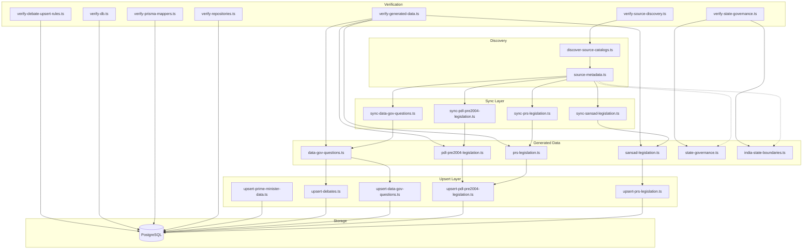
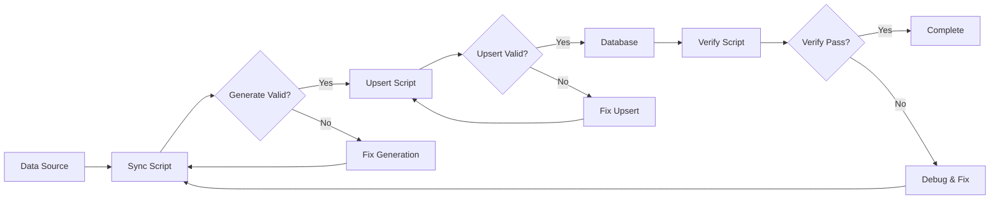

# BharatZero Data Pipeline Documentation

Complete documentation of the data ingestion, sync, and verification pipeline.

## Overview

The BharatZero data pipeline is a multi-stage system that:

1. Discovers and catalogs external data sources
2. Syncs data from official parliamentary sources
3. Generates TypeScript datasets for offline access
4. Upserts data into PostgreSQL for runtime queries
5. Verifies data integrity at each stage

## Pipeline Architecture



## Ingestion Pipeline Steps

The pipeline follows a 4-step ingestion process:

```
┌────────────────────────────────────────────────────────────────┐
│  Step 1: SOURCE_CAPTURE                                          │
│  - Fetch raw data from external sources                          │
│  - Handle authentication, rate limits, pagination              │
│  - Store raw response or immediate transformation              │
└────────────────────────────────────────────────────────────────┘
                              ↓
┌────────────────────────────────────────────────────────────────┐
│  Step 2: NORMALIZATION                                           │
│  - Transform to domain model (types.ts)                          │
│  - Clean and validate field values                               │
│  - Handle missing/null fields with defaults                      │
└────────────────────────────────────────────────────────────────┘
                              ↓
┌────────────────────────────────────────────────────────────────┐
│  Step 3: STAGE_RESOLUTION                                        │
│  - Map source-specific stages to domain BillStage              │
│  - Resolve bill lifecycle state                                  │
│  - Handle edge cases (Money Bills vs Ordinary Bills)             │
└────────────────────────────────────────────────────────────────┘
                              ↓
┌────────────────────────────────────────────────────────────────┐
│  Step 4: READ_MODEL_PUBLISH                                      │
│  - Write to generated TypeScript files                         │
│  - Upsert to PostgreSQL via Prisma                               │
│  - Maintain source provenance metadata                           │
└────────────────────────────────────────────────────────────────┘
```

## Source Adapters

### Active Sources

#### 1. Sansad Portal (sansad.in)

| Attribute | Value |
|-----------|-------|
| Script | `scripts/sync-sansad-legislation.ts` |
| Data File | `src/lib/data/generated/sansad-legislation.ts` |
| Output | Bills, BillActions, TimelineEvents, SittingDays |
| Coverage | Current legislation (post-2004) |
| Fallback | Public mirrored JSON export |

**Pipeline Flow:**
```
Sansad API → Normalization → Stage Resolution → Generated TS → Upsert to DB
```

#### 2. PRS Legislative Research (prsindia.org)

| Attribute | Value |
|-----------|-------|
| Script | `scripts/sync-prs-legislation.ts` |
| Upsert | `scripts/upsert-prs-legislation.ts` |
| Output | Historical bills (1992-2019) |
| Coverage | Pre-Sansad era legislation |

#### 3. Parliament Digital Library (eparlib.sansad.in)

| Attribute | Value |
|-----------|-------|
| Script | `scripts/sync-pdl-pre2004-legislation.ts` |
| Upsert | `scripts/upsert-pdl-pre2004-legislation.ts` |
| Output | Pre-2004 proceedings, debates, bill mentions |
| Coverage | 1947-2003 historical records |

**Note:** PDL records are proceeding-derived; some entries are bill mentions rather than clean official bill master rows.

#### 4. Data.gov.in

| Attribute | Value |
|-----------|-------|
| Discovery | `scripts/discover-source-catalogs.ts` |
| Script | `scripts/sync-data-gov-questions.ts` |
| Upserts | `scripts/upsert-data-gov-questions.ts`, `scripts/upsert-debates.ts` |
| Output | Rajya Sabha questions, debate catalogs |
| Coverage | OGD India catalog integration |

#### 5. State Governance Static Dataset

| Attribute | Value |
|-----------|-------|
| Data File | `src/lib/domain/state-governance.ts` |
| Boundary Asset | `src/lib/assets/india-state-boundaries.ts` |
| Verifier | `scripts/verify-state-governance.ts` |
| Output | States tab map/list/methodology |
| Coverage | 36 official ISO 3166-2:IN state and Union territory records |

**Notes:** V1 does not use Neon for state governance. It imports a source-backed static dataset and a self-hosted simplified India boundary asset. The verifier guards ISO coverage, map/record parity, visual palette resolution, field order, and 90-day freshness.

### Planned Sources

| Source | Status | Planned Output |
|--------|--------|----------------|
| Lok Sabha Official | Future | Direct LS bills, agenda |
| Rajya Sabha Official | Future | RS questions, Money Bill windows |
| India Code | Future | Acts, enacted law text |
| eGazette | Future | Post-assent notifications |
| NeVA | Future | State legislature data |

## Scripts Reference

### Discovery Scripts

| Script | Purpose | Command |
|--------|---------|---------|
| `discover-source-catalogs.ts` | Audit available catalogs from data.gov.in and other sources | `npm run discover:sources` |

### Sync Scripts

| Script | Source | Output |
|--------|--------|--------|
| `sync-sansad-legislation.ts` | Sansad portal | `sansad-legislation.ts` |
| `sync-prs-legislation.ts` | PRS India | `prs-legislation.ts` |
| `sync-pdl-pre2004-legislation.ts` | Parliament Digital Library | `pdl-pre2004-legislation.ts` |
| `sync-data-gov-questions.ts` | Data.gov.in | `data-gov-questions.ts` |

**Combined Commands:**
```bash
# Sync all sources
npm run sync:all

# Individual syncs
npm run sync:sansad
npm run sync:prs
npm run sync:pdl-pre2004
npm run sync:data-gov
```

### Upsert Scripts

| Script | Input | Target Table(s) |
|--------|-------|-----------------|
| `upsert-prs-legislation.ts` | `prs-legislation.ts` | Bill, BillAction, TimelineEvent |
| `upsert-pdl-pre2004-legislation.ts` | `pdl-pre2004-legislation.ts` | Bill, BillAction, TimelineEvent |
| `upsert-data-gov-questions.ts` | `data-gov-questions.ts` | Question |
| `upsert-debates.ts` | `manual-debates.ts` + `data-gov-questions.ts` | Debate, DebateTranscript metadata |
| `upsert-prime-minister-data.ts` | Hardcoded data | PrimeMinisterProfile, LokSabhaPowerSnapshot |

**Combined Commands:**
```bash
# Upsert all (dry-run)
npm run db:upsert:all:dry-run

# Upsert all (actual)
npm run db:upsert:all
```

### Verification Scripts

| Script | Purpose | Command |
|--------|---------|---------|
| `verify-source-discovery.ts` | Validate source catalog discovery | `npm run verify:source-discovery` |
| `verify-generated-data.ts` | Check generated data consistency | `npm run verify:generated` |
| `verify-ingestion-contracts.ts` | Validate source adapter contracts | `npm run verify:ingestion` |
| `verify-db.ts` | Database connectivity check | `npm run verify:db` |
| `verify-repositories.ts` | Repository layer tests | `npm run verify:repositories` |
| `verify-prisma-repository.ts` | Prisma repository tests | `npm run verify:prisma-repository` |
| `verify-prisma-mappers.ts` | Domain/Prisma mapper tests | `npm run verify:mappers` |
| `verify-timeline-view.ts` | Timeline view tests | `npm run verify:timeline` |
| `verify-data-gov-ingestion.ts` | Data.gov.in ingestion tests | `npm run verify:data-gov` |
| `verify-debate-upsert-rules.ts` | Debate upsert logic tests | `npm run verify:debate-upsert-rules` |
| `verify-debate-transcripts.ts` | Debate repository/API transcript tests | `npm run verify:debate-transcripts` |
| `verify-state-governance.ts` | Static States tab data/map tests | `npm run verify:state-governance` |

**Combined Verification:**
```bash
# Core pipeline verification
npm run verify:data-pipeline

# Full verification
npm run verify:full
```

## Data Flow Details

### 1. Source Discovery

```typescript
// scripts/discover-source-catalogs.ts

// 1. Query data.gov.in catalog API
const catalogs = await fetchDataGovCatalogs();

// 2. Parse metadata for parliamentary datasets
const parliamentaryCatalogs = catalogs.filter(isParliamentaryDataset);

// 3. Generate metadata report
const report = {
  totalCatalogs: catalogs.length,
  debateCatalogs: debateCount,
  questionCatalogs: questionCount,
  // ... metadata
};

// 4. Optional: Write discovery results
if (args.write) {
  await writeDiscoveryResults(report);
}
```

### 2. Data Sync

```typescript
// Example: sync-sansad-legislation.ts

async function syncSansadLegislation() {
  // 1. Fetch from API (with fallback)
  const data = await fetchWithFallback(
    SANSAD_API_URL,
    SANSAD_FALLBACK_URL
  );

  // 2. Transform to domain model
  const bills = data.map(normalizeToBill);
  const actions = data.flatMap(extractBillActions);
  const events = data.flatMap(extractTimelineEvents);

  // 3. Resolve bill stages
  const resolvedBills = bills.map(resolveBillStage);

  // 4. Generate TypeScript file
  await generateDataFile({
    bills: resolvedBills,
    actions,
    events,
    metadata: {
      updatedAt: new Date().toISOString(),
      source: 'sansad'
    }
  });
}
```

### 3. Data Upsert

```typescript
// Example: upsert-prs-legislation.ts

async function upsertPRSLegislation(dryRun = false) {
  const { bills, actions, events } = await loadGeneratedData();

  for (const bill of bills) {
    // 1. Check for existing record
    const existing = await prisma.bill.findUnique({
      where: { id: bill.id }
    });

    if (existing) {
      // 2. Update if source is PRS (source precedence)
      if (shouldUpdateFromSource(existing, bill, 'prs')) {
        if (!dryRun) {
          await prisma.bill.update({
            where: { id: bill.id },
            data: bill
          });
        }
      }
    } else {
      // 3. Create new record
      if (!dryRun) {
        await prisma.bill.create({ data: bill });
      }
    }
  }

  // Similar pattern for actions and events
}
```

### 4. Debate Metadata and Transcript Ownership

```typescript
// Example: upsert-debates.ts with non-destructive transcript metadata handling

async function upsertDebates() {
  const debates = [...manualDebates, ...dataGovDebates];

  for (const debate of debates) {
    await prisma.debate.upsert({
      where: { id: debate.id },
      create: debateMetadata,
      update: debateMetadataOnlyFields
    });

    if (debate.transcript_url) {
      const existing = await prisma.debateTranscript.findUnique({
        where: { debate_id: debate.id },
        select: { status: true, extracted_from_url: true }
      });

      const update = buildTranscriptMetadataUpdate(existing, {
        source_url: debate.transcript_url,
        resolved_url: debate.transcript_url,
        content_type: 'application/pdf',
        byte_length: debate.transcript_byte_length ?? null
      });

      await prisma.debateTranscript.upsert({
        where: { debate_id: debate.id },
        create: {
          debate_id: debate.id,
          source_url: debate.transcript_url,
          resolved_url: debate.transcript_url,
          content_type: 'application/pdf',
          byte_length: debate.transcript_byte_length ?? null,
          status: 'METADATA_ONLY'
        },
        update
      });
    }
  }
}
```

`upsert-debates.ts` is a catalog refresh, not a transcript extractor. It may update Debate metadata plus DebateTranscript `source_url`, `resolved_url`, `content_type`, and `byte_length`. It must not overwrite extraction-owned fields: `text`, `text_hash`, `char_count`, `error`, `extracted_at`, or `extracted_from_url`.

**STALE rule:** compare the new effective URL (`resolved_url` when present, otherwise `source_url`) with `extracted_from_url`. Only an `EXTRACTED` row with a changed effective URL becomes `STALE`. `EXTRACTED` rows with the same URL stay `EXTRACTED`, and `METADATA_ONLY` or `FAILED` rows keep their current status.

`Debate.transcript_byte_length` is the catalog-provided dashboard hint. `DebateTranscript.byte_length` is the future extraction-side measured value, and the two can legitimately disagree.

## Source Precedence

When the same bill exists from multiple sources, the upsert logic applies source precedence:

```
Priority (highest to lowest):
1. Sansad (official)     → Always preferred
2. PRS (research)        → Used when no Sansad record
3. PDL (historical)      → Used for pre-2004 records
4. Demo/Seed             → Fallback only
```

**Upsert Rule:**
```typescript
function shouldUpdateFromSource(
  existing: Bill,
  incoming: Bill,
  incomingSource: SourceKind
): boolean {
  const sourcePriority = {
    'sansad': 4,
    'lok-sabha': 4,
    'rajya-sabha': 4,
    'prs': 3,
    'pdl': 2,
    'demo-seed': 1
  };

  const existingPriority = sourcePriority[getSourceKind(existing.source_url)];
  const incomingPriority = sourcePriority[incomingSource];

  return incomingPriority >= existingPriority;
}
```

## Data Coverage

### Current Coverage (as of 2026-05-06)

| Data Type | Count | Source |
|-----------|-------|--------|
| Bills | 4,708 | Sansad + PRS + PDL |
| Bill Actions | 7,268 | Generated from bills |
| Timeline Events | 7,253 | Generated from actions |
| Sitting Days | 2,560 | Sansad |
| Acts | 217 | India Code |
| Questions | data.gov.in generated records | Data.gov.in |
| Debates | manual curated + data.gov.in catalog metadata | Manual + Data.gov.in |
| State/UT Governance | 36 | Static source-backed dataset + Bharat Maps boundary asset |
| Prime Minister Profiles | 15 | PM India (curated) |
| Lok Sabha Power Snapshots | 16 | ECI/IPU summaries |

### Historical Coverage by PM Term

| PM Term | Period | Coverage Status |
|---------|--------|-----------------|
| Nehru | 1947-1964 | PDL-based (proceeding-derived) |
| Shastri | 1964-1966 | PDL-based (limited records) |
| Indira Gandhi I | 1966-1977 | PDL-based (pre-1977) |
| Morarji Desai | 1977-1979 | PDL + Sansad |
| ... | ... | ... |
| Modi II | 2019-2024 | Full Sansad coverage |

## Verification Workflow



### Verification Commands

```bash
# 1. Verify sources are discoverable
npm run discover:sources
npm run verify:source-discovery

# 2. Verify generated data
npm run verify:generated

# 3. Verify repositories
npm run verify:repositories
npm run verify:prisma-repository
npm run verify:mappers

# 4. Verify specific views
npm run verify:timeline
npm run verify:ai
npm run verify:debate-upsert-rules
npm run verify:debate-transcripts
npm run verify:state-governance

# 5. Full pipeline check
npm run verify:data-pipeline
```

## Error Handling

### Sync Failures

| Failure Type | Handling |
|-------------|----------|
| API timeout | Retry with exponential backoff |
| API error (5xx) | Log, skip, continue with other sources |
| Parse error | Log record ID, skip invalid record |
| Network error | Use fallback mirror URL |

### Upsert Failures

| Failure Type | Handling |
|-------------|----------|
| Duplicate ID | Check source precedence, update if needed |
| Foreign key constraint | Upsert dependencies first, retry |
| Validation error | Log record, skip invalid data |
| Database connection | Retry with backoff, fail after N attempts |

### Transcript Extraction Failures

| Failure Type | Handling |
|-------------|----------|
| PDF download fail | Retry once, then mark FAILED |
| PDF parse error | Try alternative parser, mark FAILED if persistent |
| Empty text | Mark FAILED with "empty content" error |
| Size limit exceeded | Mark FAILED with "too large" error |

The extraction job is a future separate owner of the body fields. Catalog upserts only invalidate stale extracted text when the effective source URL changes.

## Monitoring

### Key Metrics

| Metric | Measurement |
|--------|-------------|
| Sync duration | Time to complete each sync script |
| Records processed | Count of bills/actions/events per sync |
| Upsert rate | Records per second during upsert |
| Error rate | Failed records / total records |
| Transcript success | Extracted / attempted transcripts |

### Health Checks

```bash
# Check database has expected record counts
npm run verify:db

# Quick pipeline health check
npm run verify:quick
```

## Best Practices

1. **Always run dry-run first:**
   ```bash
   npm run db:upsert:all:dry-run
   ```

2. **Verify after each major upsert:**
   ```bash
   npm run db:upsert:prs
   npm run verify:repositories
   ```

3. **Refresh data in stages:**
   ```bash
   npm run sync:sansad      # 1. Sync latest
   npm run verify:generated  # 2. Verify generation
   npm run db:upsert:all:dry-run  # 3. Preview changes
   npm run db:upsert:all    # 4. Apply changes
   npm run verify:data-pipeline   # 5. Full verification
   ```

4. **Commit generated data:**
   - Generated `.ts` files are source-controlled
   - They serve as offline fallback and audit trail
   - Include metadata with timestamp and source

---

## Related Documentation

- [API Reference](./API_REFERENCE.md)
- [Architecture Overview](./ARCHITECTURE.md)
- [Database Schema](./DATABASE.md)
- [Developer Guide](./DEVELOPER_GUIDE.md)
- [Bill Lifecycle Diagrams](./diagrams/bill-lifecycle.md) - Visual bill stage workflows
- [API Flow Diagrams](./diagrams/api-flows.md) - Data pipeline request flows
