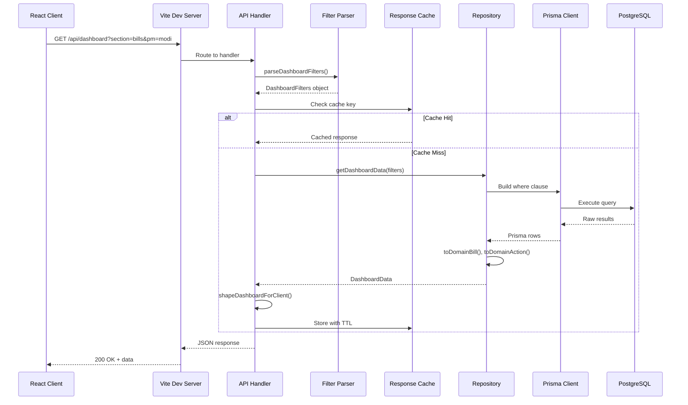
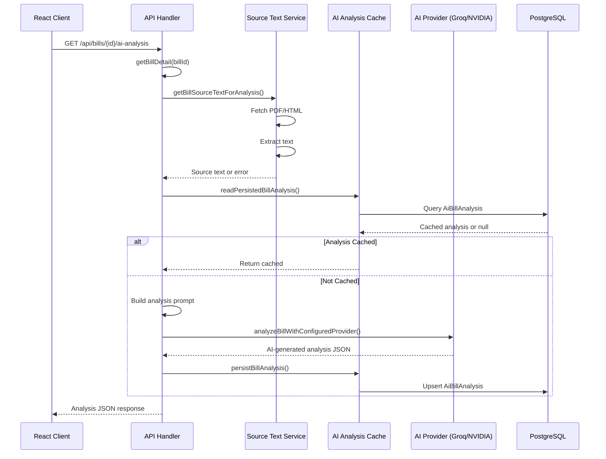
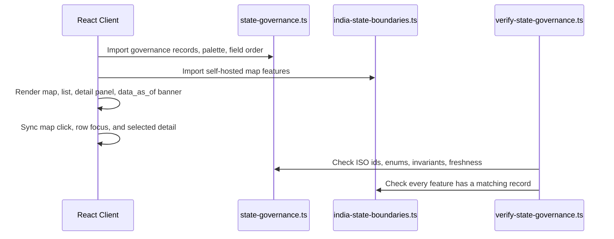
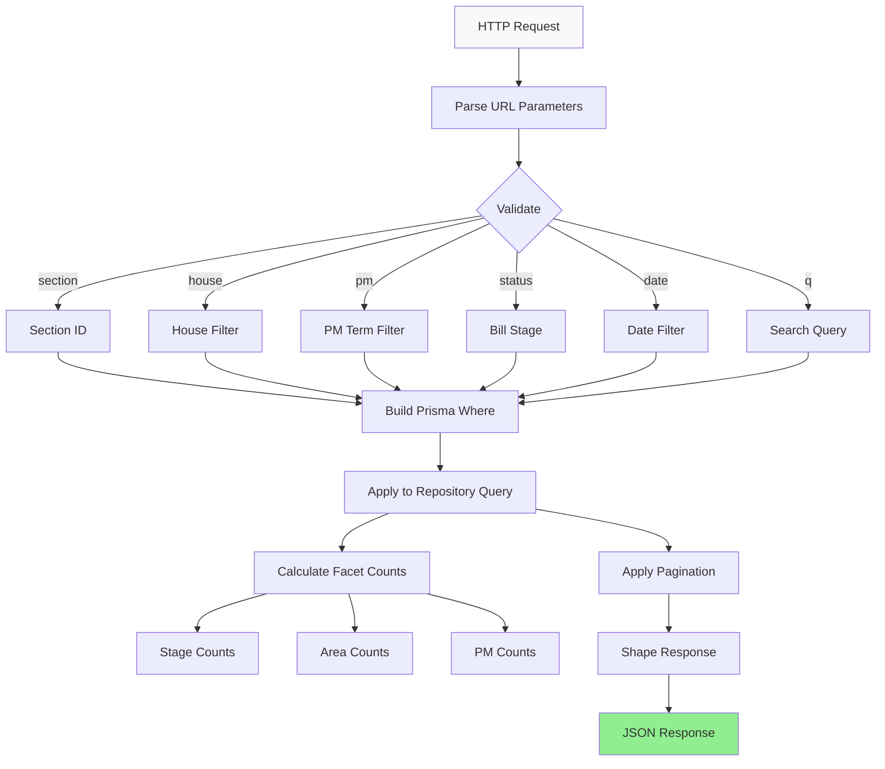
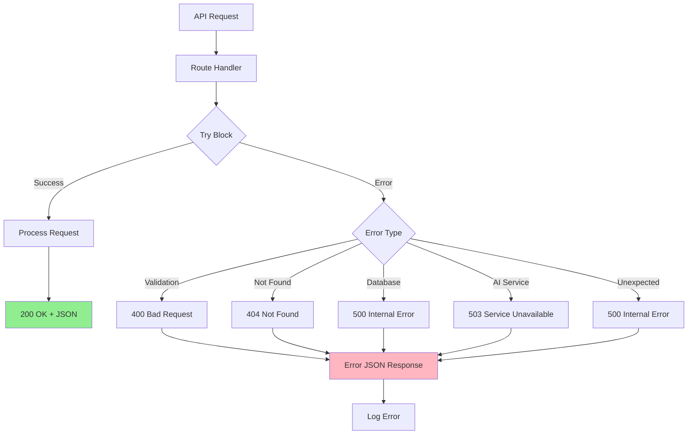

# API Request/Response Flows

## Dashboard API Flow



## Bill Detail API Flow

```mermaid
sequenceDiagram
    participant Client as React Client
    participant API as API Handler
    participant Repo as Repository
    participant Prisma as Prisma Client
    participant DB as PostgreSQL

    Client->>API: GET /api/bills/{id}

    API->>Repo: getBillDetail(billId)

    Repo->>Prisma: bill.findUnique({
        include: {
            actions: true,
            timeline_events: true,
            acts: true,
            debates: true
        }
    })

    Prisma->>DB: JOIN query
    DB-->>Prisma: Bill + relations

    Prisma-->>Repo: PrismaBill with relations
    Repo->>Repo: toDomainBill(), map relations
    Repo-->>API: BillDetailData

    API-->>Client: JSON response
```

## AI Analysis API Flow



## States Tab Static Flow



The States tab does not call `/api/dashboard`; `section=states` is a URL/navigation state for the browser UI.

## Filter Application Flow



## Error Handling Flow


