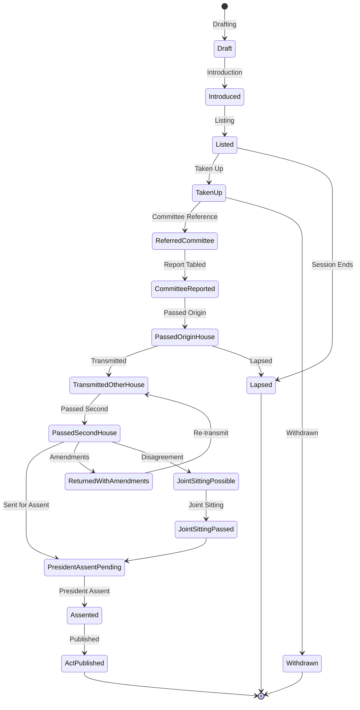
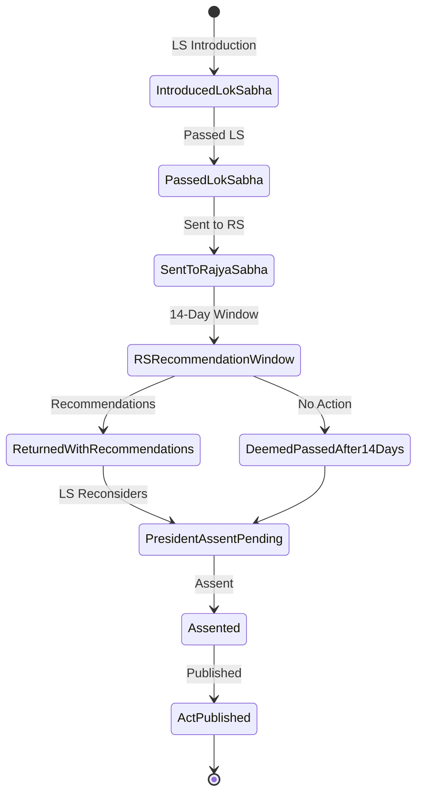
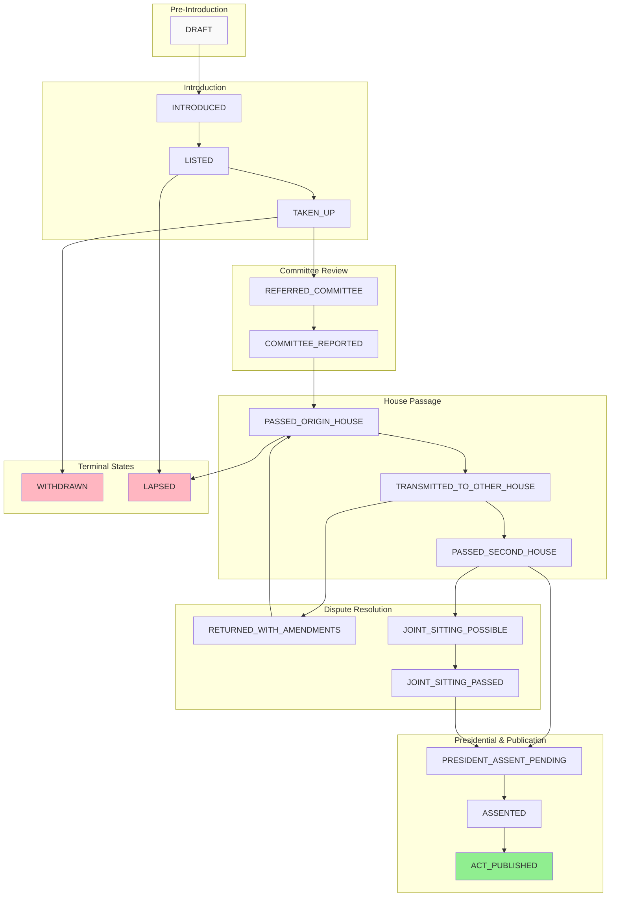

# Bill Lifecycle State Machine

## Ordinary Bill Flow

```mermaid
stateDiagram-v2
    [*] --> Draft: Drafting
    Draft --> Introduced: Introduction
    Introduced --> Listed: Listing
    Listed --> TakenUp: Taken Up
    TakenUp --> ReferredCommittee: Committee Reference
    ReferredCommittee --> CommitteeReported: Report Tabled
    CommitteeReported --> PassedOriginHouse: Passed Origin
    PassedOriginHouse --> TransmittedOtherHouse: Transmitted
    TransmittedOtherHouse --> PassedSecondHouse: Passed Second
    PassedSecondHouse --> PresidentAssentPending: Sent for Assent
    PresidentAssentPending --> Assented: President Assent
    Assented --> ActPublished: Published
    ActPublished --> [*]

    PassedSecondHouse --> ReturnedWithAmendments: Amendments
    ReturnedWithAmendments --> TransmittedOtherHouse: Re-transmit

    PassedSecondHouse --> JointSittingPossible: Disagreement
    JointSittingPossible --> JointSittingPassed: Joint Sitting
    JointSittingPassed --> PresidentAssentPending

    TakenUp --> Withdrawn: Withdrawn
    Listed --> Lapsed: Session Ends
    PassedOriginHouse --> Lapsed: Lapsed
    Withdrawn --> [*]
    Lapsed --> [*]
```

## Money Bill Flow

```mermaid
stateDiagram-v2
    [*] --> IntroducedLokSabha: LS Introduction
    IntroducedLokSabha --> PassedLokSabha: Passed LS
    PassedLokSabha --> SentToRajyaSabha: Sent to RS
    SentToRajyaSabha --> RSRecommendationWindow: 14-Day Window

    RSRecommendationWindow --> ReturnedWithRecommendations: Recommendations
    ReturnedWithRecommendations --> PresidentAssentPending: LS Reconsiders

    RSRecommendationWindow --> DeemedPassedAfter14Days: No Action
    DeemedPassedAfter14Days --> PresidentAssentPending

    PresidentAssentPending --> Assented: Assent
    Assented --> ActPublished: Published
    ActPublished --> [*]
```

## Stage Transitions Detail

```mermaid
flowchart TD
    subgraph DraftPhase["Pre-Introduction"]
        D[DRAFT]
    end

    subgraph IntroductionPhase["Introduction"]
        I[INTRODUCED]
        L[LISTED]
        TU[TAKEN_UP]
    end

    subgraph CommitteePhase["Committee Review"]
        RC[REFERRED_COMMITTEE]
        CR[COMMITTEE_REPORTED]
    end

    subgraph PassagePhase["House Passage"]
        POH[PASSED_ORIGIN_HOUSE]
        TT[TRANSMITTED_TO_OTHER_HOUSE]
        PSH[PASSED_SECOND_HOUSE]
    end

    subgraph ResolutionPhase["Dispute Resolution"]
        RWA[RETURNED_WITH_AMENDMENTS]
        JSP[JOINT_SITTING_POSSIBLE]
        JSPP[JOINT_SITTING_PASSED]
    end

    subgraph FinalPhase["Presidential & Publication"]
        PAP[PRESIDENT_ASSENT_PENDING]
        A[ASSENTED]
        AP[ACT_PUBLISHED]
    end

    subgraph TerminalPhase["Terminal States"]
        W[WITHDRAWN]
        LAP[LAPSED]
    end

    D --> I
    I --> L
    L --> TU
    TU --> RC
    TU --> W
    L --> LAP

    RC --> CR
    CR --> POH

    POH --> TT
    POH --> LAP

    TT --> PSH
    TT --> RWA

    PSH --> PAP
    PSH --> JSP

    RWA --> POH

    JSP --> JSPP
    JSPP --> PAP

    PAP --> A
    A --> AP

    style D fill:#f9f9f9
    style AP fill:#90EE90
    style W fill:#FFB6C1
    style LAP fill:#FFB6C1
```
