# Frontend Component Architecture

## Component Hierarchy Overview

### Application Entry & Shell

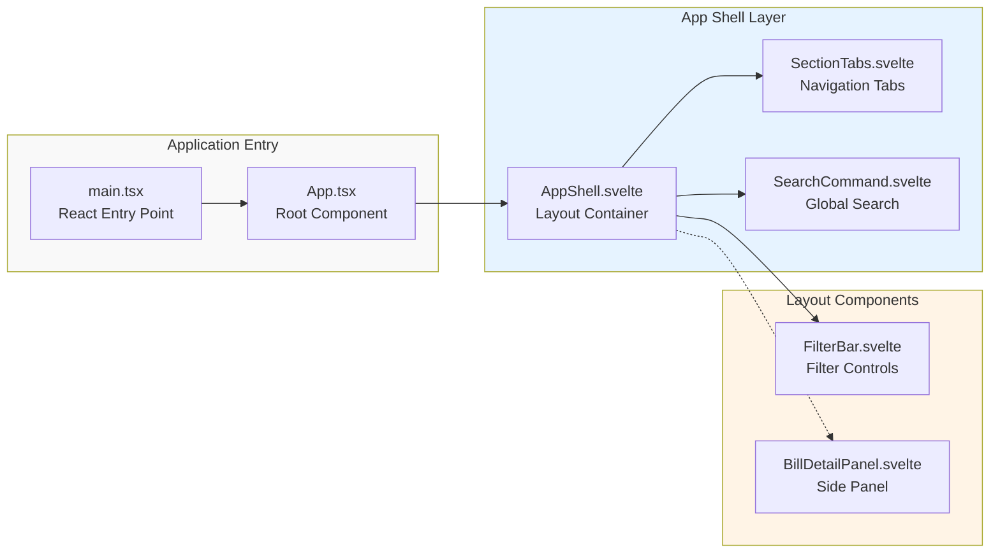

### Section Views (Primary Content Areas)

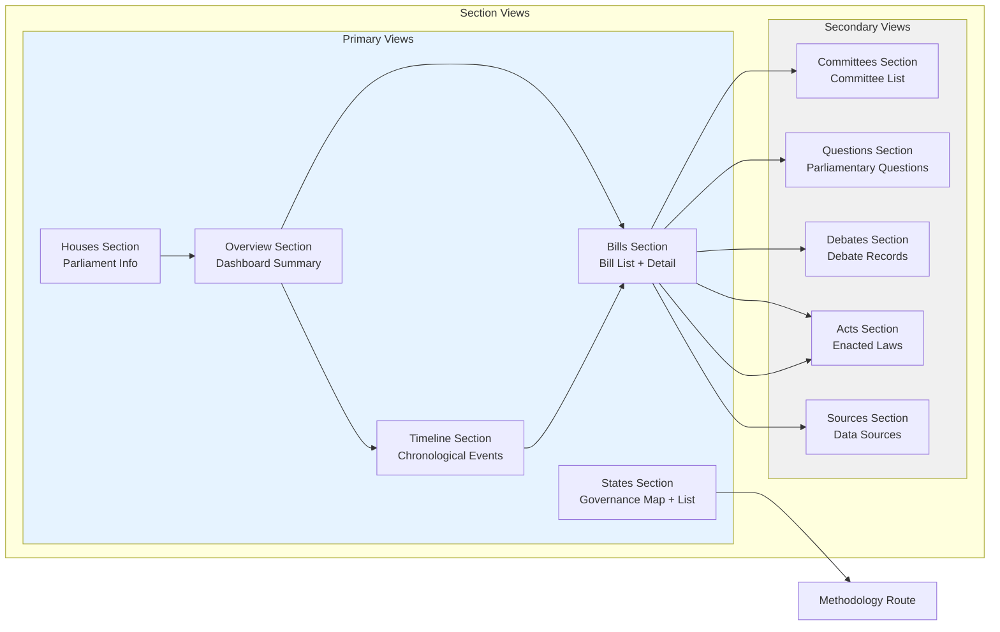

### Bill Component Hierarchy

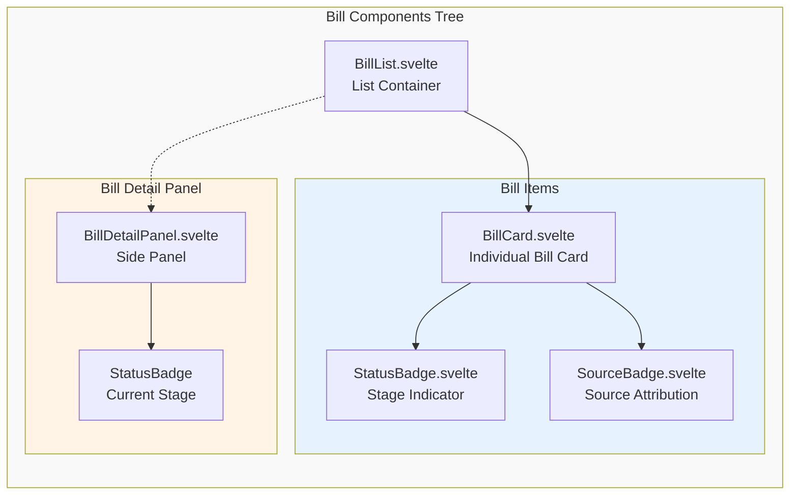

### Timeline Component Hierarchy

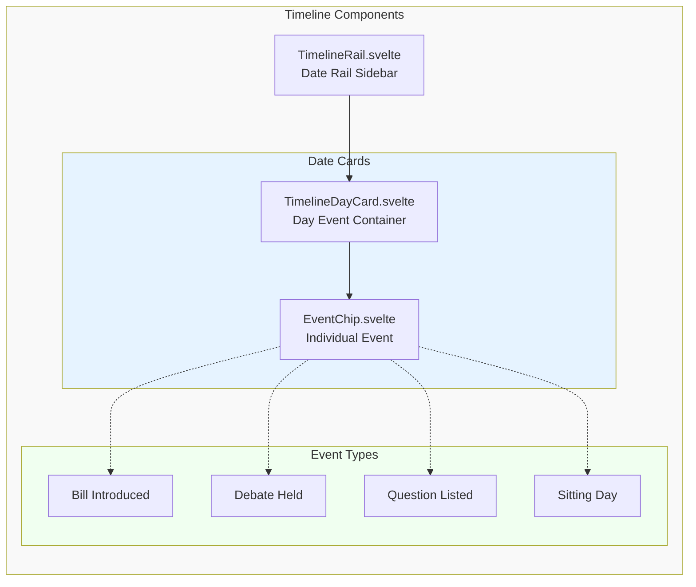

### Filter Components

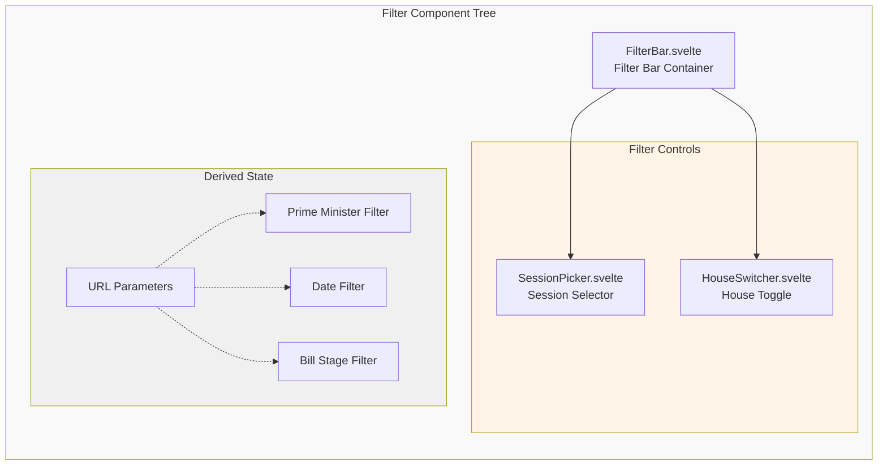

### Shared Components (Reusable UI)

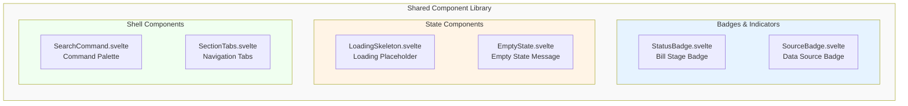

### Complete Component Map

```mermaid
flowchart TB
    subgraph Root["📦 Application Root"]
        Main[main.tsx]
        App[App.tsx]
    end

    subgraph AppShell["🏗️ App Shell"]
        Shell[AppShell.svelte]
        Tabs[SectionTabs.svelte]
        Search[SearchCommand.svelte]
    end

    subgraph Content["📄 Content Areas"]
        FilterBar[FilterBar.svelte]

        subgraph Sections["Section Views"]
            Overview[Overview]
            Bills[Bills]
            Timeline[Timeline]
            Houses[Houses]
            States[States]
            Committees[Committees]
            Questions[Questions]
            Debates[Debates]
            Acts[Acts]
            Sources[Sources]
        end
    end

    subgraph Components["🧩 Feature Components"]
        subgraph BillFeature["Bill Feature"]
            BillList[BillList.svelte]
            BillCard[BillCard.svelte]
            BillDetail[BillDetailPanel.svelte]
        end

        subgraph TimelineFeature["Timeline Feature"]
            TimelineRail[TimelineRail.svelte]
            TimelineCard[TimelineDayCard.svelte]
            EventChip[EventChip.svelte]
        end

        subgraph FilterFeature["Filter Feature"]
            SessionPicker[SessionPicker.svelte]
            HouseSwitcher[HouseSwitcher.svelte]
        end

        subgraph StatesFeature["States Feature"]
            StatesSection[StatesSection.tsx]
            StateGov[State Governance Data]
            IndiaMap[India Boundary Asset]
        end
    end

    subgraph Shared["🎨 Shared UI"]
        StatusBadge[StatusBadge.svelte]
        SourceBadge[SourceBadge.svelte]
        EmptyState[EmptyState.svelte]
        Loading[LoadingSkeleton.svelte]
    end

    Main --> App
    App --> Shell
    Shell --> Tabs
    Shell --> Search
    Shell --> FilterBar

    Shell --> Overview
    Shell --> Bills
    Shell --> Timeline
    Shell --> Houses
    Shell --> States
    Shell --> Committees
    Shell --> Questions
    Shell --> Debates
    Shell --> Acts
    Shell --> Sources

    Bills --> BillList
    BillList --> BillCard
    Bills -.-> BillDetail

    Overview --> BillList
    Overview --> TimelineRail
    Timeline --> TimelineRail
    TimelineRail --> TimelineCard
    TimelineCard --> EventChip

    FilterBar --> SessionPicker
    FilterBar --> HouseSwitcher

    States --> StatesSection
    StatesSection --> StateGov
    StatesSection --> IndiaMap

    BillCard --> StatusBadge
    BillCard --> SourceBadge
    BillDetail --> StatusBadge

    Committees --> EmptyState
    Questions --> EmptyState
    Debates --> EmptyState

    style Root fill:#f9f9f9
    style AppShell fill:#e6f3ff
    style Content fill:#fff4e6
    style Components fill:#f0fff0
    style Shared fill:#f0f0f0
```

## Data Flow

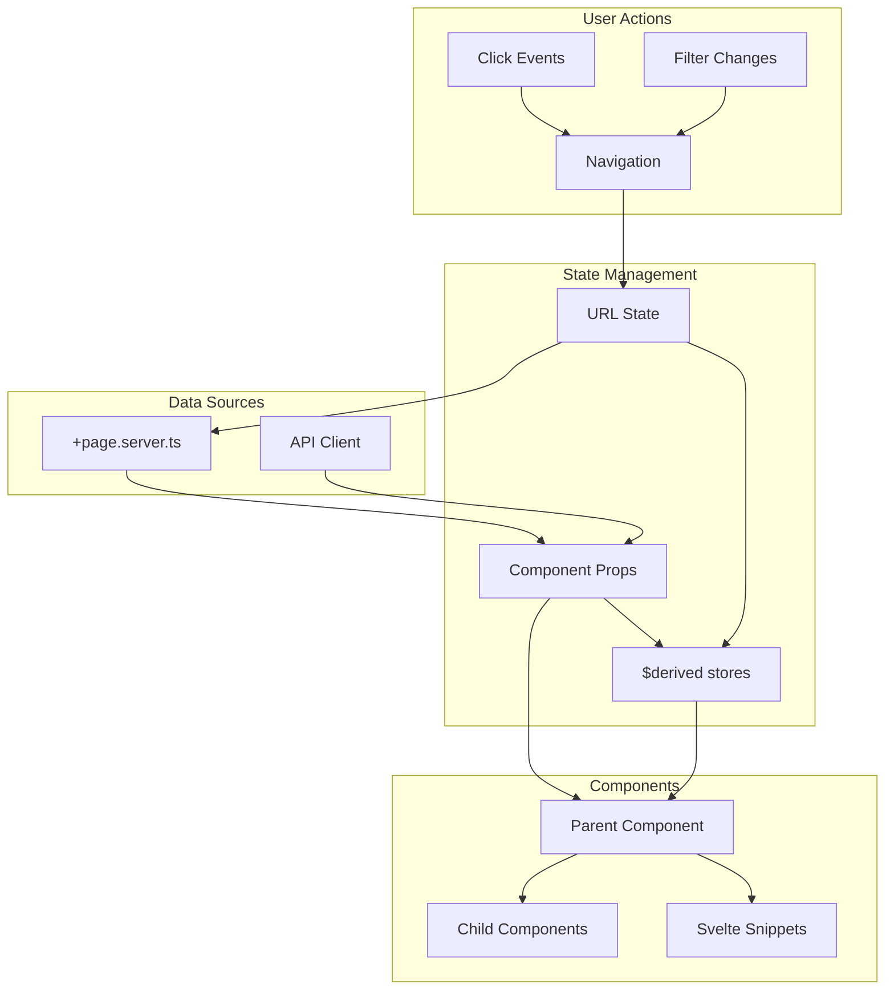

## State Governance Tab Flow

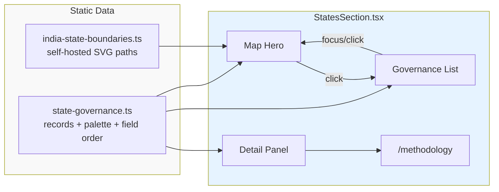

## Section Routing

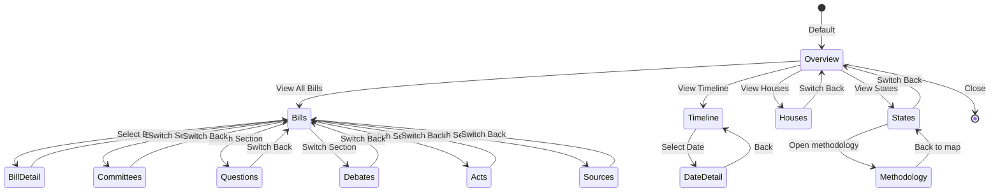

## Filter System Architecture

```mermaid
flowchart LR
    subgraph Inputs["Filter Inputs"]
        URLParams[URL Parameters]
        UserInput[User Input]
    end

    subgraph Parsing["Filter Parsing"]
        Parse[parseDashboardFilters]
        Validate{Validation}
        Defaults[Apply Defaults]
    end

    subgraph State["Filter State"]
        Section[section: SectionId]
        House[house: House | 'all']
        PM[primeMinister: PMFilter]
        Status[status: BillStage | 'all']
        Date[date: string]
        Query[query: string]
        Page[page: number]
    end

    subgraph Application["Filter Application"]
        BuildURL[Build Href]
        UpdateState[Update $derived]
        Refetch[Trigger Data Load]
    end

    URLParams --> Parse
    UserInput --> Parse

    Parse --> Validate
    Validate -->|Invalid| Defaults
    Validate -->|Valid| State
    Defaults --> State

    State --> BuildURL
    State --> UpdateState
    UpdateState --> Refetch

    Refetch --> ServerLoad[+page.server.ts]
    BuildURL --> History[History API]
```

## Bill Detail View State

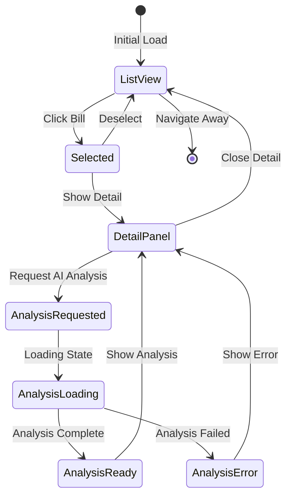
