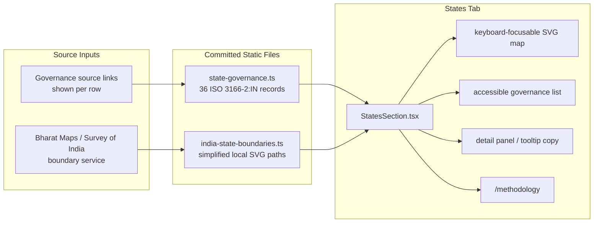
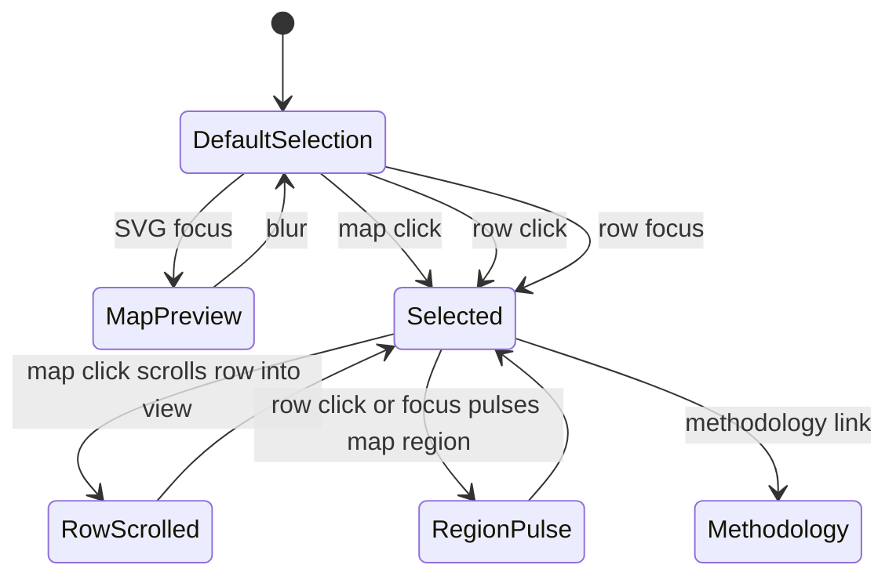
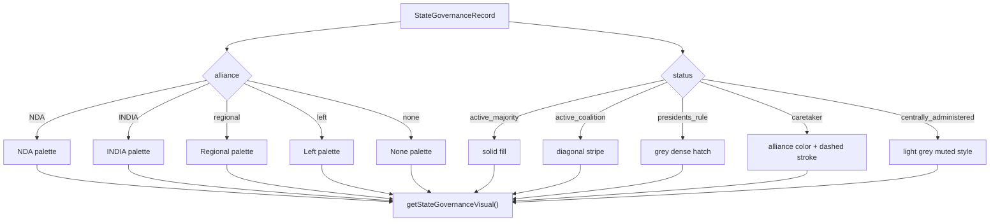
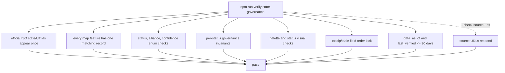

# State Governance Diagrams

Visual documentation for the States tab. V1 is static and source-backed: the governance records live in TypeScript, the boundary geometry is self-hosted, and the verifier guards coverage and freshness.

## Static Data Flow

## Interaction Flow

Keyboard focus previews/selects without forcing the page to jump; explicit map clicks scroll the matching row.

## Visual Resolution

All colors resolve through `STATE_GOVERNANCE_VISUAL_PALETTE`; components do not define separate map hex values.

## Verification Flow

`verify:data-pipeline` includes `verify:state-governance`, so the static States tab is checked with the rest of the project verification path.
