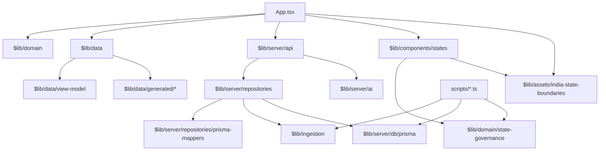

# BharatZero Module Documentation

Detailed documentation for key modules and their public APIs.

## Module Index

- [Domain Layer](#domain-layer)
  - [types.ts](#domaintypes)
  - [dashboard-filters.ts](#domaindashboard-filters)
  - [prime-ministers.ts](#domainprime-ministers)
  - [timeline-view.ts](#domaintimeline-view)
  - [state-governance.ts](#domainstate-governance)
- [Server Layer](#server-layer)
  - [bharatzero-api.ts](#serverapibharatzero-api)
  - [legislative.ts](#serverrepositorieslegislative)
  - [prisma-mappers.ts](#serverrepositoriesprisma-mappers)
- [Data Layer](#data-layer)
  - [view-model.ts](#datalibdataview-model)
  - [seed.ts](#datalibdataseed)
- [Ingestion Layer](#ingestion-layer)
  - [source-adapters.ts](#libingestionsource-adapters)

---

## Domain Layer

### `$lib/domain/types`

Core domain type definitions for the legislative system.

#### Type: `Bill`

Represents a legislative bill.

```typescript
type Bill = {
  id: string;
  title_en: string;
  title_hi: string;
  bill_number: string;
  bill_year: number;
  bill_type: BillType;
  origin_house: House;
  current_stage: BillStage;
  ministry: string;
  introduced_on: string;
  latest_action_date: string;
  source_url: string;
  summary: string;
  isDemoSeed: boolean;
};
```

**Usage:**
```typescript
import type { Bill } from '$lib/domain/types';

function displayBill(bill: Bill): string {
  return `${bill.bill_number}: ${bill.title_en}`;
}
```

#### Type: `BillAction`

Represents an action in a bill's lifecycle.

```typescript
type BillAction = {
  id: string;
  bill_id: string;
  date: string;
  house: House;
  action_type: TimelineEventType | 'money_bill_window' | 'president_assent';
  description: string;
  source_url: string;
  isDemoSeed: boolean;
};
```

#### Constants: `SECTION_IDS`

Available UI sections.

```typescript
export const SECTION_IDS = [
  'overview',
  'houses',
  'states',
  'timeline',
  'bills',
  'committees',
  'questions',
  'debates',
  'acts',
  'sources'
] as const;
```

**Usage:**
```typescript
import { SECTION_IDS, type SectionId } from '$lib/domain/types';

function isValidSection(section: string): section is SectionId {
  return SECTION_IDS.includes(section as SectionId);
}
```

---

### `$lib/domain/state-governance`

Static governance model for the States tab.

#### Type: `StateGovernanceRecord`

```typescript
type StateGovernanceRecord = {
  id: string; // ISO 3166-2:IN, e.g. IN-MH
  name_en: string;
  name_local: string;
  type: 'state' | 'ut_with_assembly' | 'ut_without_assembly';
  status: 'active_majority' | 'active_coalition' | 'presidents_rule' | 'caretaker' | 'centrally_administered';
  alliance: 'NDA' | 'INDIA' | 'regional' | 'left' | 'none';
  lead_party: string | null;
  member_parties: string[];
  chief_minister: string | null;
  event_date: string;
  source_url: string;
  source_org: string;
  last_verified: string;
  confidence: 'verified' | 'pending' | 'disputed';
};
```

#### Constants and Helpers

```typescript
const STATE_GOVERNANCE_RECORDS: StateGovernanceRecord[];
const STATE_GOVERNANCE_DATA_AS_OF: string;
const EXPECTED_STATE_GOVERNANCE_FIELD_ORDER: StateGovernanceDisplayField[];
function getStateGovernanceVisual(record: StateGovernanceRecord): StateGovernanceVisual;
```

**Usage:**
```typescript
import {
  STATE_GOVERNANCE_RECORDS,
  getStateGovernanceVisual
} from '$lib/domain/state-governance';

const maharashtra = STATE_GOVERNANCE_RECORDS.find((record) => record.id === 'IN-MH');
const visual = maharashtra ? getStateGovernanceVisual(maharashtra) : null;
```

`lead_party` means the Chief Minister's party. `member_parties` is always an array; centrally administered UTs use `[]`.

---

### `$lib/domain/dashboard-filters`

URL filter parsing and validation.

#### Function: `parseDashboardFilters`

Parses URL search params into validated filter object.

```typescript
function parseDashboardFilters(searchParams: URLSearchParams): DashboardFilters;
```

**Parameters:**
- `searchParams` - URL search parameters

**Returns:** `DashboardFilters` object with validated values

**Supported Filters:**
- `section` - Section ID (required)
- `lang` - Language: 'en' | 'hi'
- `pm` - PM term ID or 'all'
- `house` - House filter: 'all' | 'lok-sabha' | 'rajya-sabha'
- `date` - Date in YYYY-MM-DD format
- `status` - Bill stage filter
- `area` - Ministry/policy area
- `source` - Source family filter
- `page` - Page number (default: 1)
- `pageSize` - Items per page (default: 60)

**Usage:**
```typescript
import { parseDashboardFilters } from '$lib/domain/dashboard-filters';

const url = new URL('http://localhost:5173/?section=bills&pm=nehru&page=1');
const filters = parseDashboardFilters(url.searchParams);
// filters = { section: 'bills', pmTermId: 'nehru', page: 1, ... }
```

---

### `$lib/domain/prime-ministers`

Prime Minister term definitions and date range utilities.

#### Constant: `PRIME_MINISTER_TERMS`

Array of all PM terms with metadata.

```typescript
const PRIME_MINISTER_TERMS: Array<{
  id: string;
  name: string;
  termStart: string;
  termEnd: string;
  party: string;
  lokSabha: string;
}>;
```

#### Function: `getPrimeMinisterTerm`

Get PM term by ID.

```typescript
function getPrimeMinisterTerm(termId: string): PrimeMinisterTerm | undefined;
```

#### Function: `getPrimeMinisterTermDateRange`

Get date range for PM term filtering.

```typescript
function getPrimeMinisterTermDateRange(
  termId: PrimeMinisterFilter
): { start: Date; end: Date } | null;
```

**Usage:**
```typescript
import {
  PRIME_MINISTER_TERMS,
  getPrimeMinisterTerm,
  getPrimeMinisterTermDateRange
} from '$lib/domain/prime-ministers';

// Get all PMs
console.log(PRIME_MINISTER_TERMS.length); // 15

// Get specific PM
const nehru = getPrimeMinisterTerm('nehru');

// Get date range for filtering
const range = getPrimeMinisterTermDateRange('modi-2');
// range = { start: Date('2019-05-30'), end: Date('2024-06-09') }
```

---

### `$lib/domain/timeline-view`

Timeline grouping and date rail generation.

#### Function: `groupTimelineEventsByDate`

Groups timeline events by date for display.

```typescript
function groupTimelineEventsByDate(
  events: TimelineEvent[]
): Array<{ date: string; events: TimelineEvent[] }>;
```

#### Function: `buildTimelineDateRail`

Builds date navigation rail for timeline view.

```typescript
function buildTimelineDateRail(
  events: TimelineEvent[],
  options?: { startDate?: Date; endDate?: Date }
): Array<{ date: string; count: number; hasEvents: boolean }>;
```

**Usage:**
```typescript
import {
  groupTimelineEventsByDate,
  buildTimelineDateRail
} from '$lib/domain/timeline-view';

const events = await fetchTimelineEvents();

// Group by date
const grouped = groupTimelineEventsByDate(events);
// grouped = [
//   { date: '2024-01-15', events: [...] },
//   { date: '2024-01-16', events: [...] }
// ]

// Build date rail
const rail = buildTimelineDateRail(events);
// rail = [
//   { date: '2024-01-01', count: 0, hasEvents: false },
//   { date: '2024-01-15', count: 3, hasEvents: true }
// ]
```

---

## Server Layer

### `$lib/server/api/bharatzero-api`

Main API request handler.

#### Function: `handleBharatZeroApi`

Entry point for all API requests.

```typescript
function handleBharatZeroApi(
  request: IncomingMessage,
  response: ServerResponse
): Promise<void>;
```

**Routes Handled:**

| Route | Method | Handler |
|-------|--------|---------|
| `/api/health` | GET | Health check |
| `/api/dashboard` | GET | Dashboard data |
| `/api/bills/:id` | GET | Bill detail |
| `/api/bills/:id/ai-analysis` | GET | AI analysis |
| `/api/prime-ministers` | GET | PM list |
| `/api/prime-ministers/:id` | GET | PM detail |
| `/api/houses/power` | GET | House power |
| `/api/sources` | GET | Source catalog |

**Usage:**
```typescript
import { handleBharatZeroApi } from '$lib/server/api/bharatzero-api';

// In server.ts
const server = createServer((req, res) => {
  if (req.url?.startsWith('/api/')) {
    return handleBharatZeroApi(req, res);
  }
  // ... serve static files
});
```

---

### `$lib/server/repositories/legislative`

Repository pattern for legislative data access.

#### Type: `LegislativeRepository`

Interface for legislative data operations.

```typescript
interface LegislativeRepository {
  getDashboardData(filters: DashboardFilters): Promise<DashboardData>;
  getBillDetail(billId: string): Promise<BillDetailData | null>;
}
```

#### Function: `createLegislativeRepository`

Factory function for creating repository instances.

```typescript
function createLegislativeRepository(options: {
  mode?: RepositoryMode;
  prisma?: PrismaReadClient;
}): LegislativeRepository;
```

**Modes:**
- `'seed'` - Uses generated TypeScript data files
- `'prisma'` - Uses PostgreSQL via Prisma

**Usage:**
```typescript
import { createLegislativeRepository } from '$lib/server/repositories/legislative';
import { createPrismaClient } from '$lib/server/db/prisma';

// Prisma mode (production)
const prisma = createPrismaClient();
const repo = createLegislativeRepository({
  mode: 'prisma',
  prisma
});

// Fetch dashboard
const dashboard = await repo.getDashboardData({
  section: 'bills',
  lang: 'en',
  page: 1,
  pageSize: 50
});

// Fetch bill detail
const detail = await repo.getBillDetail('bill-123');
```

#### Type: `DataSourceMeta`

Metadata about the data source.

```typescript
type DataSourceMeta = {
  mode: RepositoryMode;
  label: string;
  isLiveOfficialData: boolean;
};
```

---

### `$lib/server/repositories/prisma-mappers`

Type conversion between Prisma and domain models.

#### Functions

Convert from Prisma format to domain format:

```typescript
function toDomainBill(prismaBill: PrismaBill): Bill;
function toDomainBillAction(prismaAction: PrismaBillAction): BillAction;
function toDomainTimelineEvent(prismaEvent: PrismaTimelineEvent): TimelineEvent;
function toDomainCommittee(prismaCommittee: PrismaCommittee): Committee;
function toDomainQuestion(prismaQuestion: PrismaQuestion): Question;
function toDomainDebate(prismaDebate: PrismaDebate): Debate;
function toDomainAct(prismaAct: PrismaAct): Act;
function toDomainSittingDay(prismaSitting: PrismaSittingDay): SittingDay;
```

Convert from domain to Prisma format:

```typescript
function fromDomainHouse(house: House): PrismaHouse;
function fromDomainBillStage(stage: BillStage): PrismaBillStage;
```

**Usage:**
```typescript
import { toDomainBill, fromDomainHouse } from '$lib/server/repositories/prisma-mappers';

// Convert from Prisma result to domain type
const prismaBill = await prisma.bill.findUnique({ where: { id: '123' } });
const domainBill = toDomainBill(prismaBill);

// Convert domain value to Prisma enum
const prismaHouse = fromDomainHouse('lok-sabha');
// prismaHouse = 'LOK_SABHA'
```

---

## Data Layer

### `$lib/data/view-model`

View model types for UI data shaping.

#### Type: `DashboardData`

Complete dashboard response structure.

```typescript
type DashboardData = {
  filters: DashboardFilters;
  meta: DashboardMeta;
  seedMeta: SeedMeta;
  sources: SourceEntry[];
  bills: Bill[];
  billActions: BillAction[];
  timelineEvents: TimelineEvent[];
  timelineGroups: TimelineGroup[];
  timelineDateRail: DateRailItem[];
  committees: Committee[];
  questions: Question[];
  debates: Debate[];
  acts: Act[];
  actBills: Bill[];
  primeMinisters: PrimeMinisterListItem[];
  houses: HouseMeta[];
  lokSabhaPower: LokSabhaPowerSnapshot | null;
};
```

#### Type: `BillDetailData`

Bill detail view structure.

```typescript
type BillDetailData = {
  bill: Bill;
  actions: BillAction[];
  timelineEvents: TimelineEvent[];
  acts: Act[];
  aiAnalysis: AiBillAnalysis | null;
  sourceTexts: BillSourceText[];
};
```

---

### `$lib/data/seed`

Seed data loading for repository mode.

#### Function: `loadSeedData`

Loads generated seed data from TypeScript files.

```typescript
function loadSeedData(): {
  bills: Bill[];
  billActions: BillAction[];
  timelineEvents: TimelineEvent[];
  sittingDays: SittingDay[];
  committees: Committee[];
  questions: Question[];
  debates: Debate[];
  acts: Act[];
};
```

**Usage:**
```typescript
import { loadSeedData } from '$lib/data/seed';

const seed = loadSeedData();
console.log(`Loaded ${seed.bills.length} bills from seed data`);
```

---

## State Governance UI

### `$lib/components/states/StatesSection`

React component for the States tab and methodology route.

#### Responsibilities

- Imports `STATE_GOVERNANCE_RECORDS` and `INDIA_STATE_MAP_FEATURES`
- Renders the desktop map hero and accessible list/table
- Keeps map selection, row focus, and detail panel synchronized
- Uses centralized palette/status visuals from `state-governance.ts`
- Links to `/methodology`

### `$lib/assets/india-state-boundaries`

Self-hosted simplified India state/UT SVG path data.

```typescript
const INDIA_STATE_MAP_FEATURES: IndiaStateMapFeature[];
const INDIA_STATE_MAP_VIEWBOX: string;
const INDIA_STATE_MAP_SOURCE: {
  org: string;
  url: string;
  note: string;
};
```

The verifier requires every map feature ID to match one static governance record.

---

## Ingestion Layer

### `$lib/ingestion/source-adapters`

Source adapter definitions and metadata.

#### Type: `OfficialSourceAdapter`

Configuration for an external data source.

```typescript
type OfficialSourceAdapter = {
  id: SourceKind;
  name: string;
  baseUrl: string;
  status: AdapterStatus;
  authority: 'union-parliament' | 'union-law' | 'open-data' | 'gazette' | 'state-legislature';
  supportedHouses: House[];
  outputs: AdapterOutput[];
  notes: string;
};
```

#### Constant: `officialSourceAdapters`

Registry of all source adapters.

```typescript
const officialSourceAdapters: OfficialSourceAdapter[];
```

**Included Adapters:**
- `sansad` - Sansad portal (primary)
- `lok-sabha` - Lok Sabha pages (future)
- `rajya-sabha` - Rajya Sabha pages (future)
- `india-code` - India Code (future)
- `data-gov` - Data.gov.in (active)
- `egazette` - eGazette (future)
- `neva` - NeVA state legislatures (future)

#### Function: `getPreparedSourceAdapters`

Get all configured adapters.

```typescript
function getPreparedSourceAdapters(): OfficialSourceAdapter[];
```

#### Function: `getAdapterOutputSummary`

Get summary of adapter coverage by output type.

```typescript
function getAdapterOutputSummary(): Record<AdapterOutput, number>;
```

**Usage:**
```typescript
import {
  officialSourceAdapters,
  getPreparedSourceAdapters,
  getAdapterOutputSummary
} from '$lib/ingestion/source-adapters';

// List all adapters
console.log(officialSourceAdapters.map(a => a.name));

// Get active adapters
const active = getPreparedSourceAdapters().filter(a => a.status === 'using-now');

// Get output coverage
const summary = getAdapterOutputSummary();
// summary = { bills: 3, bill_actions: 3, debates: 2, ... }
```

---

## Module Dependencies



---

## For More Information

- See [API Reference](./API_REFERENCE.md) for endpoint documentation
- See [Architecture Overview](./ARCHITECTURE.md) for system design
- See [Developer Guide](./DEVELOPER_GUIDE.md) for development workflows
